# Using the technology TEST

## Quick start

If you want to explore the platform yourself, you can use test therapist and test patient logins provided to try out the features. We generally recommend that you use the platform while reading this manual, to test features as you go along.

**Therapists access the platform via this URL: [https://webcbt.se/ocdnet](https://webcbt.se/ocdnet)**. This is where therapists enter their username and password to enter the treatment platform. This URL can be used for both OCD-NET and BDD-NET.

## Platform use overview

There are five common scenarios during the course of treatment:

- Responding to messages
- Reviewing homework
- Opening new treatment modules
- Reviewing questionnaires
- Responding to warning flags

These actions can all be accessed in the participant overview, shown below:
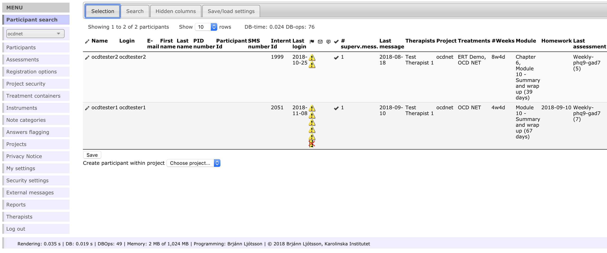

A typical day as a therapist includes responding to one or more messages, reviewing homework and opening up a new module. Once in a while therapists contact inactive patients or assess a warning flag.

The majority of day to day tasks are accessed via the *Participant search* menu. The menu is located at the left-hand side of the browser window. Closing the current participant and clicking *Participant search* will get you back to the participant overview. To access individual participants, click the pencil next to their name.

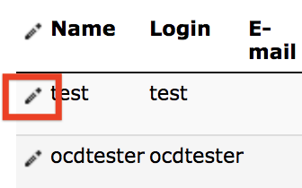

## Navigation

The menu bar on the left may expand depending on administrative rights. Other parts of the menu include administrative settings such as editing treatment content, editing assessments, editing conditions for when participant assessments are flagged, and changing settings to the site itself. These will not be relevant to most therapists and we do not cover them in detail here. Just remember that you can always go back to the default view by closing the current participant and navigating to *Participant search* in the left-hand menu.

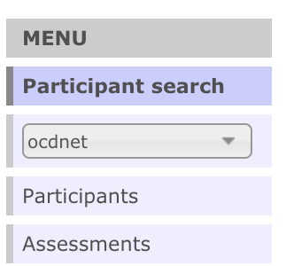

## Filtering the participant overview

To get a quick overview of a long participant list, filter patients that meet certain criteria, for example belonging to certain groups in treatment of certain treatments. There is a button called *Selection* above the participant list. We recommend that therapists use the "My participants" filter to show only patients assigned to them.

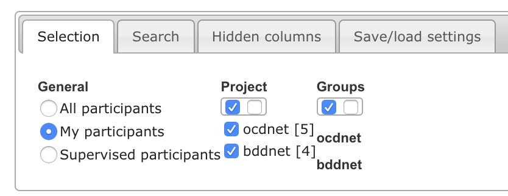

## Writing and responding to messages

A new message from a patient will be indicated by this icon  in the participant overview. Click the pencil next to the participant's name to access that patient. Navigate to *Treatments -> participant messages* to view the message and write a response. See the chapter [Being an effective ICBT therapist][Being an effective ICBT therapist] for guidelines on how to write messages.

## Homework review

A completed homework assignment is shown in the **Homework** column in the participant overview. Click the pencil next to the participant and navigate to *Treatments -> Treatment access* to review the homework and mark it as completed.

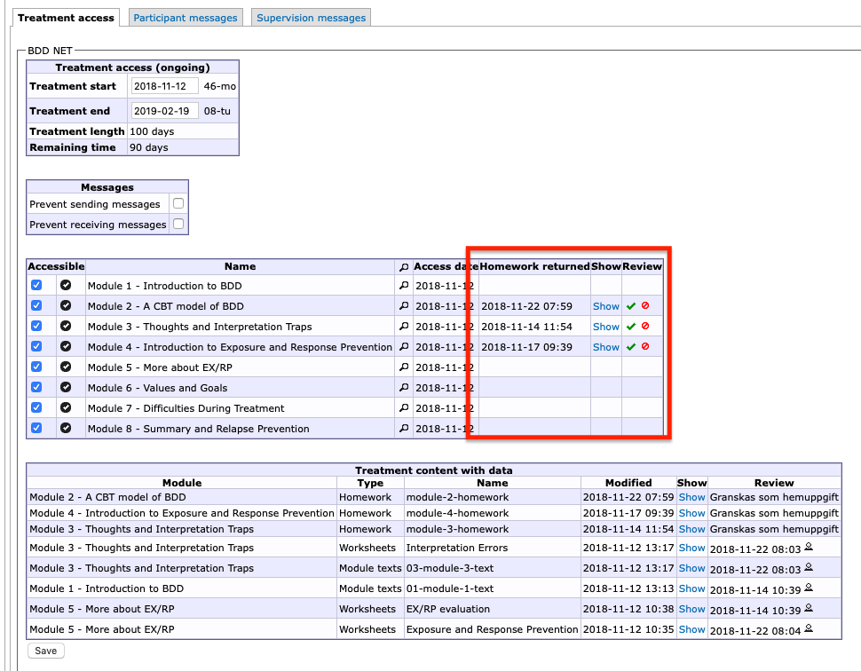

Please note that patients are not notified if you mark the homework as incomplete. Write a message to explain what additional information you need from the patient when they send it in again.

Internet-based CBT relies heavily on self-directed activities and homework review is a good time to check whether the patient has grasped important concepts and are able to apply them to their own situation.

## Treatment modules

When a patient has read a module and completed the corresponding homework assignment(s), they are ready for the next module. To grant access to a new module, navigate to *Treatments -> Treatment access* and check the box next to the next module. A date will appear next to the module indicating when the module was activated.

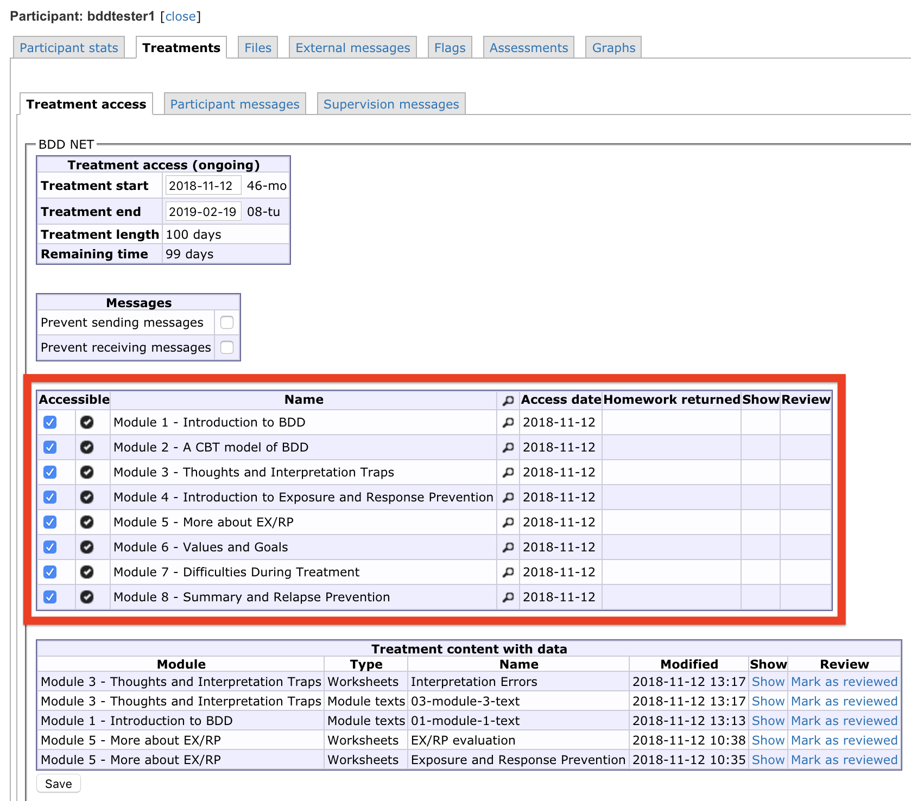

The number of modules and weeks in treatment varies between treatment protocols but a rough guideline is that patients should progress through one module per week. Some treatment techniques, like exposure with response prevention, are spread out across several modules to emphasise their importance and give participants sufficient time to get started on the technique.

## Questionnaires

Before, during, and after treatment, patients are asked to fill out questionnaires. When new questionnaires are activated they appear as the patient logs onto the platform. Therapists can review and change which questionnaires should appear at which day in *Assessments* but we recommend that therapists stick to the standard schedule whenever possible. Questionnaires for each patient are listed in this view, click the paper icon to view responses.

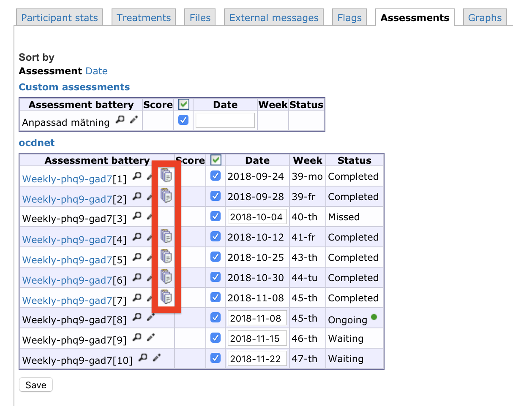

## Warning flags

The ICBT platform will display a *warning flag* next to a patient's name for certain events. The most common flags are due to non-response to questionnaires. These serve as prompts to therapists to take further action, for example reaching out by phone to a patient or sending them another text message reminder.

Once a warning flag has been noticed and dealt with, indicate the action taken in the *temporary flag text* box in the *Participant stats* tab (shown below).
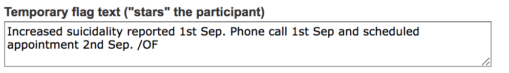

* Patient has not responded to measurement in time: 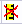

### Suicidality warning flags

The most important type of warning flag is due to heightened suicidality. The platform is configured to display this flag if a patient responds 2 or 3 on the suicidality question in PHQ-9.

* Warning flag to indicate suicidal ideation: 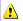

Therapists should refer to local clinical guidelines when performing suicidality assessments and taking action. We recommend that therapists ask for guidance of their supervisors if there are any uncertainties.

Once the level of suicidality is deemed to be low enough to not require further attention, therapists can remove the warning flag under the *Flags* tab for the participant. Flags are listed under the Flags tab, click on the pencil to edit a flag.

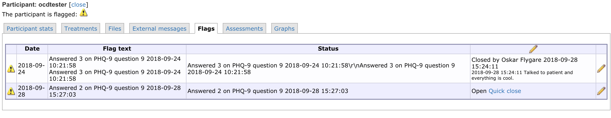

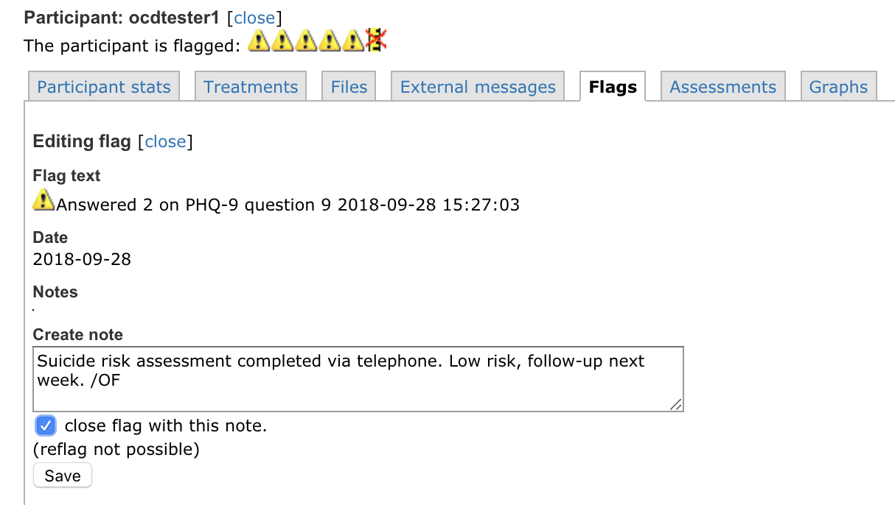

## Supervision

Supervision through the platform makes it easy to connect feedback from the supervisor to specific therapist messages and actions. The supervision page is found at *Treatment -> Supervision messages* for each participant. It will look different for the therapist that is supervised and the supervisor.

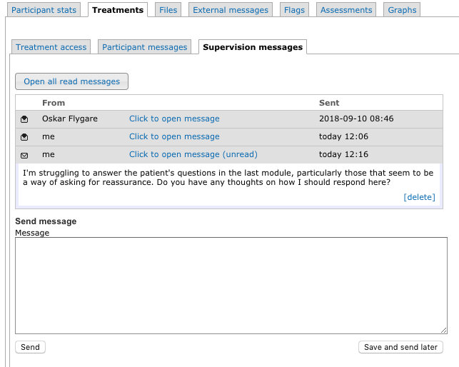

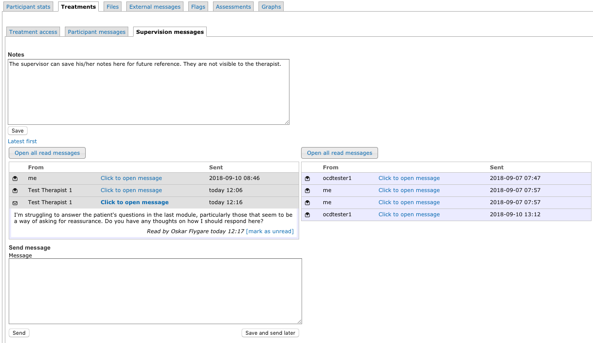

The notes are only visible to the supervisor, so that he/she can write comments about the supervision for future reference. If you are a supervisor, new messages to review are indicated by an icon for messages. 

## Assign new therapist

The most typical scenario is that each patient is treated by one therapist throughout treatment, but it is not uncommon for a second therapist to act as backup if the primary therapist is not available.

To assign another therapist or change therapist, navigate to the patient in question and click the *Participant stats* tab. At the bottom of that page, there is a list of therapists and those assigned to the patient will have a checkmark next to them. Simply un-check whoever is to be removed and check whoever is to be assigned the patient.

## Create new patient login

To create a new patient login on the platform, go to the participant overview by selecting *Participant search* in the left-hand menu. Select *Create new participant* at the bottom of the participant list. Therapists can use the "change password" button to generate secure passwords for patients.

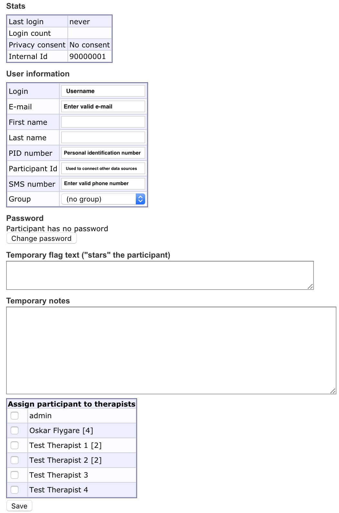

Fields not needed are:

* Temporary flag text: Usually not needed at creation but might come in handy later for communicating between therapists
* Temporary notes: Usually not needed but can be used to store information

## OCD-NET and BDD-NET for patients

We encourage therapists using OCD-NET and BDD-NET to login with one of the test patient accounts to see what the platform looks like for patients. See below for a quick overview of the patient platform.

### Access

Patients access the platform from the patient-URL, which is different from the therapist URL.

* [OCD-NET](https://ocdnet.webcbt.se)    
* [BDD-NET](https://bddnet.webcbt.se)  

### Using the technology as a patient

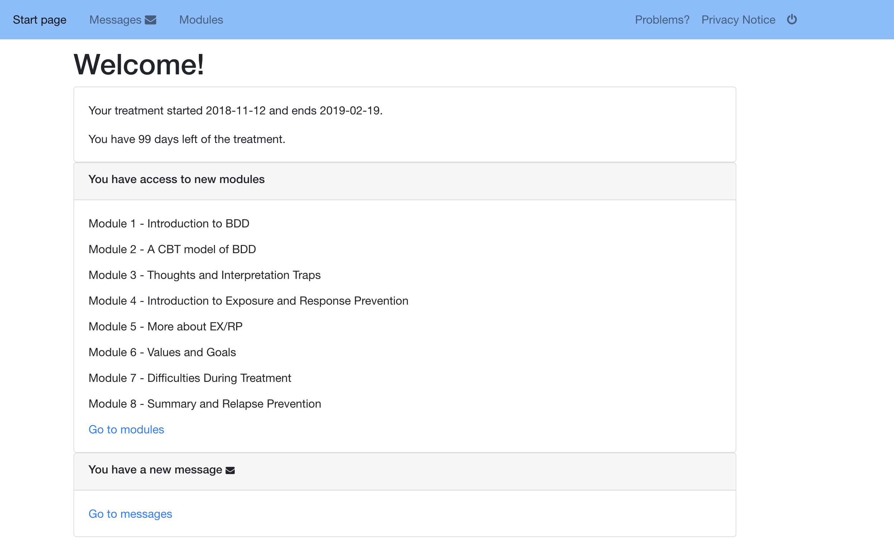

The landing page for patients includes basic information about the treatment, whether they have been granted access to new modules or have received new messages.

In the menu bar at the top of the page, patients can easily navigate the platform, view treatment content, report problems, and see the *Privacy Notice*.

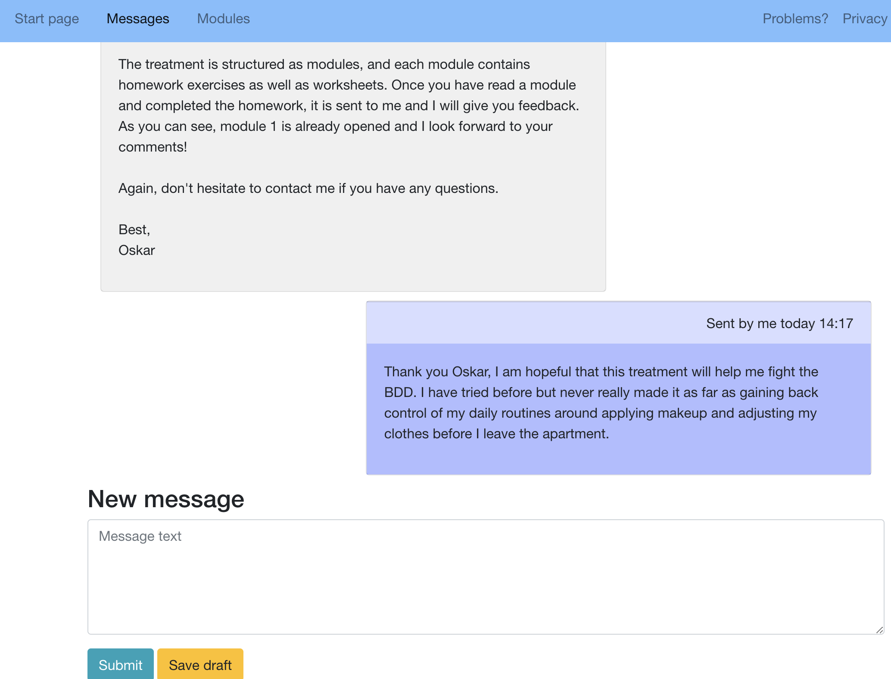

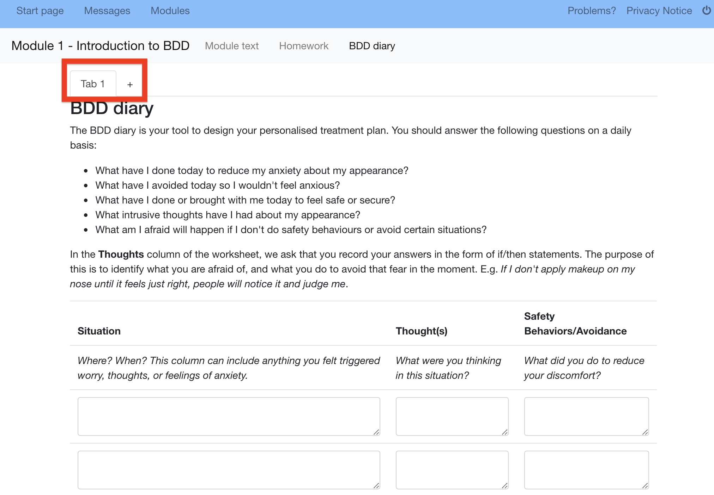

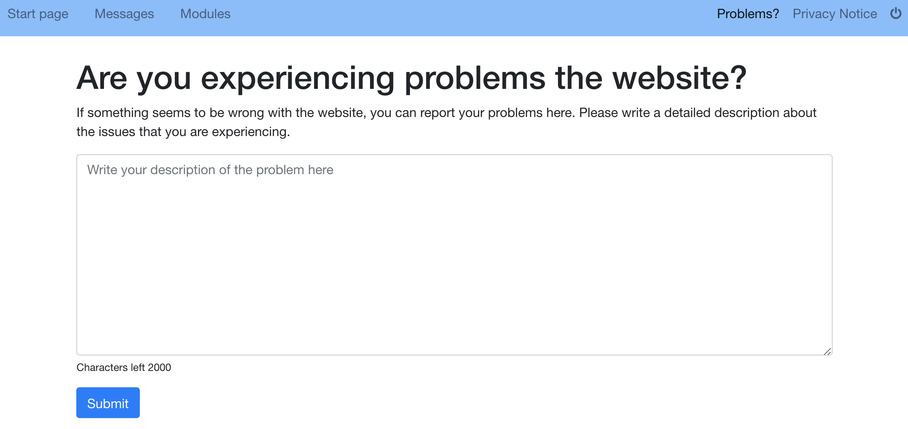