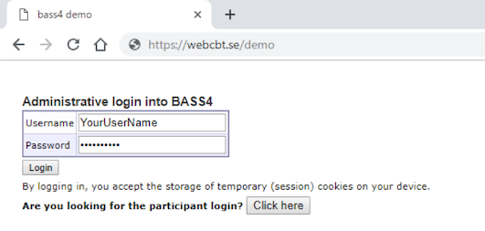

# Login {#login}

As soon as your database setup is ready, you can login to the administrator’s interface. The interface is found at an URL of the format `https://NameOfYourDatabase-admin.webcbt.se/` or `https://NameOfYourDatabase-admin.bassdb.se/`. 
 
You will have your login credentials supplied by us, and logging in will require 2FA (two-factor authentication) through either SMS or through an authenticator app (Authy, Google Authenticator, Microsoft Authenticator).
 
Enter your credentials in the login box and press the Login button.
 
 

  
After this you will be taken to a page for double authentication. The code could arrive to you by sms or email depending on how your database is set up.
  

  
*2FA alternatives can be handled in Security Settings, see* ***Chapter 6***
