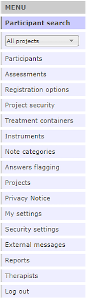
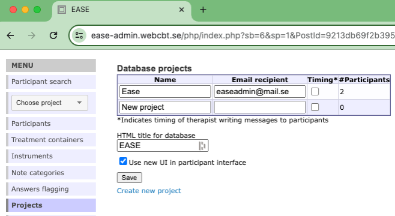
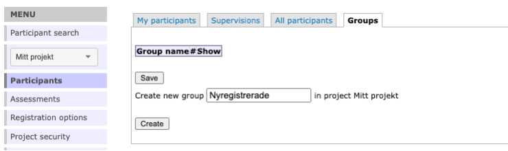

# Getting your bearings: Navigating the administrator's interface

Now, let’s turn to the administrative interface. You access this through either https://YourDataBase-admin.webcbt.se/ or https://YourDataBase-admin.bassdb.se/. 

All functionality in the BASS administration interface can be accessed from the main menu to the left of your screen. 

What options are visible in the main menu depends on what privileges have been assigned to your profile. A common setup is that one administrator manages the available instruments and assessments, while several therapists manage their own participants and individual treatments. This manual is written to cover BASS in its entirety. The image below shows all available menu options, as presented to database administrators.

Now, let’s examine what substitutes the main menu:

**Participant Search** lets you search specific data points relevant to the participants registered in the active project. The *Search* tab will show what information is searchable. See ***Chapter 9*** for further details.

The **Project** dropdown menu lets you choose what project to view. This governs which participants and what assessments you can access. Instruments and treatments are shared between projects. To switch projects, simply use the dropdown menu.

**Participants** lets you see an overview over all the participants registered in the active project. In this overview you can see if a participant is flagged, has sent messages or reported an error, among other information. See ***Chapter 10*** for further details.

**Assessments** is only shown if you have selected a project from the **Project** dropdown menu. Here, you can view, create and edit assessments. See ***Chapter 12*** for further details.

**Registration options** is only shown if you have selected a project. This view lets you define the parameters of the registration procedure built into BASS, should you elect to use it. You can define what information you want participants to submit, and write detailed information about your study or treatment to be presented. You can also opt to present consent forms during the registration process. See ***Chapter 8*** for further details.

**Project security** lets you define what security measures your project will use, such as two-factor authentication. These settings pertain to *participants'* use of the system. See ***Chapter 6*** for a more in-depth look at security settings.

The **Treatment containers** view lets you view, create and edit treatments to be used within BASS. See ***Chapter 13*** for more on how to build treatment content in BASS.

The **Instruments** view lets you view, create, edit and delete instruments to be used within BASS. See ***Chapter 11*** for further details.

**Note categories** lets you define custom note categories to be used to sort information on participants.

**Answers flagging** lets you set and define rules to flag specific answers or answer ranges in instruments that you want to quickly be notified about, should a participant give those answers.

The **Projects** lets your view and create projects within the database.

**Privacy notice** lets you view and edit the privacy notice(s) for the database and its projects. This is mandatory information in the EU that needs to be made available to all potential participants. If you use the built in registration procedure in BASS, this privacy notice is presented there.

**My settings** lets you view the settings of your therapist login.

**Security settings** lets you view and edit the security settings of the database, such as a general mailbox and expiry time for quick login codes. See ***Chapter 6*** for further details.

**External messages** lets you manage default settings for outgoing communication to participants and therapists. This is, for example, notifications and reminders about active assessments, notifications on treatment chat messages, and definition of sms-sender. See ***Chapter 7*** for further details.

**Reports** lets you extract reports on data collected through instruments and assessments in BASS. This part of BASS in undergoing a major update, and the manual will be updated to reflect the new Reports feature once it goes live.

**Therapists** lets you view, create and edit therapist logins in the database. See ***Chapter 14*** for further details.

**Log out** simply logs you out of the database and ends your current session.

## The intended structure of a BASS project

Now that we’ve familiarized ourselves with the main menu and its options, let’s take a moment and look at the internal structure of BASS, and how it’s set up.
As you’ve surely gathered by now, the foundation of BASS is the **database**. This is the foundational level upon with all other layers are applied. The next level is the **project**. You can have just one project in your database, or you can have several. Participants are placed in to projects, but may be moved from one project to another if necessary. Each project in your database has its own

  - Participants and groups
  - Assessments
  - Registration (and unique URL to that registration)
  - Settings for answers flagging (all projects can also share global flagging settings)
  - Privacy notice
  
The next level in this structure is **groups**. They can be used to group participants *within* a project. This enables you do administer different sets of assessments to different groups of participants, for example. It also lets you use groups as a sorting tool in your reports.
An important note is that instruments and treatments are stored at the database level, meaning they are accessible from all projects within the database. Assessments, however, are stored at the project level and are as such not shared between projects.
And to clarify: participants and groups are also not shared between projects.

### Setting up projects
Now, how do I set up my project? And what do I need to get started? 
You can get started without setting up a project, and start by building instruments and treatments. However, it is recommended that you get into the habit of setting up your project prior to doing much else within your database. Doing so helps you stay oriented.
 
To set up your project, simply navigate to **Projects** and click *Create new project*, type a name into the box and click Save. Your new project will then be shown in a table just above the name box.

>**Note:** It is not possible to remove a project. So if you accidentally create one, just give it a name to indicate that it is not in use.

 
For each project one can specify an *email recipient*. This e-mail address is shown to participant as the contact e-mail in case they’re experiencing issues related to the specific project. It is also used as a fallback address for unhandled participant task emails in case a participant does not have a therapist assigned to them (so that they won’t go unnoticed if they report a lost password or score an instrument in a manner that requires immediate attention). If there is no email address specified for the project the *General mailbox for database* specified under **External messages** is used (see **Chapter \@ref(ExtMess)**).
  
One can also specify *HTML title for database* in order to give both the administrator and participant interface a title. In the image below you see that the HTML title shows up as the tab name for the interface.
  
If you want therapists to be able to log time on their communication with participants, you need to check *Timing* on the project to activate that feature. See more on this in **Chapter \@ref(PartTreat) Participant Treatments**.
  
Last but not least you can see how many participants are included in each project in the column *#Participants*.
  

### Setting up groups
If you want to use groups in your project, for example to administer different cohorts, navigate to **Participants**, and to the tab labeled **Groups**. To create a group, simply type the name into the text box and click *Create*. If you want to edit this name later on, you can easily do so by editing the name directly in its box and click *Save*.

>**Hint:**If you haven’t decided whether you need groups or not, you can hold off on creating groups for now. If you know you won’t need groups, you can simply forgo creating any groups.

