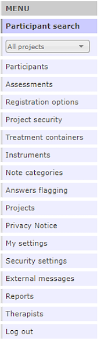

# The main menu

All functionality in the BASS administration interface can be accessed from the main menu to the left of your screen. 

What options are visible in the main menu depends on what privileges have been assigned to your profile. A common setup is that one administrator manages the available instruments and assessments, while several therapists manage their own participants and individual treatments.

