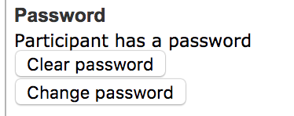

# Technical support

This page contains support for common issues that might arise when using the OCD-NET and BDD-NET treatments.

## Technical support for patients

The platform is designed to be user-friendly for patients with varying technical know-how. They will, however, require technical support from time to time. If patients report technical issues that you cannot address yourself, send an email to <ocdnet.support@webcbt.se> and ask for assistance.

### Forgotten username or password

If a patient has forgotten their password, they can request a new one at the login screen:

If they have forgotten their username, simply look at their *Participant stats* and **Login** is their username.

If a patient is unable to generate a new password on their own, navigate to the patient in question and the *Participant stats* tab. Click the *Change password* button. The site generates a new, secure, password that can be sent to the patient via SMS.

### The website does not work

This is usually for one of three reasons: wrong information (URL/username/password), the patient is using an out of date web browser, or there is an issue with cookies on the site.

#### Wrong URL/username/password

Make sure that the patient has correct information for all three. Also make sure that there are no errors in the username!

- URL is [https://ocdnet.webcbt.se](https://ocdnet.webcbt.se) for OCD and [https://bddnet.webcbt.se](https://bddnet.webcbt.se) for BDD
- Username is indicated by "Login" at *Participant stats*
- Their password is hidden to therapists and can be re-generated by patients themselves or by therapists (see above)

#### Recommended web browsers

The treatment is accessible for both desktop web browsers and mobile web browsers (iOS, Android). The platform works best for either **Google Chrome**, **Firefox**, or **Safari**. Internet explorer and Microsoft Edge are not recommended, although newer versions of those browsers usually work just fine.

#### Cookies and cache

Sometimes the browser will save cookies that interfere with access to the treatment platform. This can usually be resolved by clearing cookies and restarting the browser.

- [Google Chrome](https://support.google.com/chrome/answer/95647?co=GENIE.Platform%3DDesktop&hl=en)
- [Firefox](https://support.mozilla.org/en-US/kb/delete-cookies-remove-info-websites-stored)
- [Safari desktop](https://support.apple.com/kb/ph21411?locale=en_US)
- [Safari iOS](https://support.apple.com/en-gb/HT201265)

## Technical support for therapists

### Creating an account

Send an e-mail to us <ocdnet.support@webcbt.se> containing the following information:

* Username
* Full name
* e-mail
* Phone number (to receive login codes via text messages)

We then create a user and generate a password to be replaced at the first login.

### Forgotten password

Admins are able to reset therapist passwords in the *Therapist* tab of the left-hand menu. Click the button called "Must change password" to initiate a password change for that user.

## Other technical issues

Have you spotted an error in the treatment content? Are the questionnaires not displaying correctly? Did you accidentally make some changes that you are not able to revert?

Anything else that is not reviewed in this guide, please let ut know by sending an e-mail to us at <ocdnet.support@webcbt.se> and we will help you.

We strive to improve the treatment content and the experience for therapists continuously and welcome any feedback!
