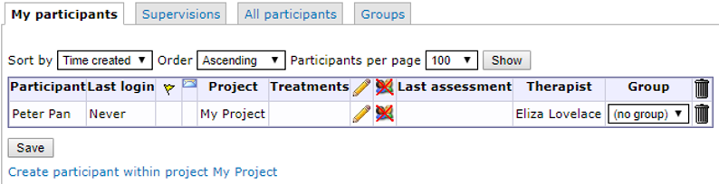

# Participants

The "Participants" view is one way to access participant information. It is very similar to the "Participant search" view, and it is mostly down to personal preference on which to use. You can customize "Participant search" to show exactly the data you want to see, while "Participants" is predefined and more simplistic. One important difference remains, however: the **"Groups"** tab, which only exists under "Participants".

Depending on which project is selected in the dropdown in the main menu, the result in the "Participants" view will differ. If a specific project is selected, only participants in that project wil be shown under each tab.

In "Participants", there are four tabs: 

- *My participants*, which shows you any participants assigned to you (as a therapist)
- *Supervisions*, which is similiar to "Supervised participants"
- *All participants*, which shows you all participants in a project. If no project is selected, it will show all participants in the database.
- *Groups*, which shows you the groups created in a project, and gives you the tools to manage them.

## Creating, deleting and editing participants
You can create new participants in two of the tabs in the Participants view; *My participants* and *All participants*. Participants that are created in the *My participants* tab will be tagged as your participants automatically, while participants created in the *All participants* tab won't be tagged.
To create a new participant, click *Create participant within project [Project Name]*. Newly created participants are added at the bottom of each view.

Te delete at participant, click the trash bin icon to the far right of the corresponding participant's row.

To edit a participant, click the pencil icon in the table, on the corresponding participant's row. This will take you to the "Participant stats" view. 
If you only wish to change, or add, what group a participant belongs to, you can do so directly in the *Group* column of the participant table by using the dropdown. When you've assigned a participant to a group this way, don't forget to click the "Save" button at the bottom of the table.

## The participant view
When you create or edit a participant, the participant view is shown. To exit this view, and return to the participants table, click the "close" text to the right of the participant's name. If you made any changes to the participant, don't forget to save them by clicking the "Save" button at the bottom of the page.

There are seven tabs in this view:

- *Participants stats*, where you can view all fundamental information on the participant
- *Treatments*, where you can view and manage any treatments connected to the participant
- *Files*, where you can upload files relevant to the participant. These files cannot be viewed by the participant, but only by therapist who have access to the participant.
- *External messages*, where you can manually send SMS or e-mail messages to the participant, and review the status on any previously sent external messages.
- *Flags*, where you can view any flags the participant might have.
- *Assessments*, where you can view and manage assessments for the participant. You can also activate or deactivate individually managed assessment through this view.
- *Graphs*, where you can see graphs on the answers the participant has given on recurring assessments.

### Participant stats