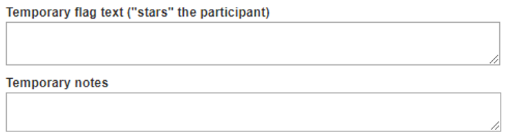
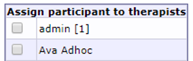

# Participants

The "Participants" view is one way to access participant information. It is very similar to the "Participant search" view, and it is mostly down to personal preference on which to use. You can customize "Participant search" to show exactly the data you want to see, while "Participants" is predefined and more simplistic. One important difference remains, however: the **"Groups"** tab, which only exists under "Participants".

Depending on which project is selected in the dropdown in the main menu, the result in the "Participants" view will differ. If a specific project is selected, only participants in that project wil be shown under each tab.

In "Participants", there are four tabs: 

- *My participants*, which shows you any participants assigned to you (as a therapist)
- *Supervisions*, which is similiar to "Supervised participants"
- *All participants*, which shows you all participants in a project. If no project is selected, it will show all participants in the database.
- *Groups*, which shows you the groups created in a project, and gives you the tools to manage them.

## Creating, deleting and editing participants
You can create new participants in two of the tabs in the Participants view; *My participants* and *All participants*. Participants that are created in the *My participants* tab will be tagged as your participants automatically, while participants created in the *All participants* tab won't be tagged.
To create a new participant, click *Create participant within project [Project Name]*. Newly created participants are added at the bottom of each view.

To delete at participant, click the trash bin icon to the far right of the corresponding participant's row.

To edit a participant, click the pencil icon in the table, on the corresponding participant's row. This will take you to the "Participant stats" view. 
If you only wish to change, or add, what group a participant belongs to, you can do so directly in the *Group* column of the participant table by using the dropdown. When you've assigned a participant to a group this way, don't forget to click the "Save" button at the bottom of the table.

## The participant view
When you create or edit a participant, the participant view is shown. To exit this view, and return to the participants table, click the "close" text to the right of the participant's name. If you made any changes to the participant, don't forget to save them by clicking the "Save" button at the bottom of the page.

There are seven tabs in this view:

- *Participants stats*, where you can view all fundamental information on the participant
- *Treatments*, where you can view and manage any treatments connected to the participant
- *Files*, where you can upload files relevant to the participant. These files cannot be viewed by the participant, but only by therapist who have access to the participant.
- *External messages*, where you can manually send SMS or e-mail messages to the participant, and review the status on any previously sent external messages.
- *Flags*, where you can view any flags the participant might have.
- *Assessments*, where you can view and manage assessments for the participant. You can also activate or deactivate individually managed assessment through this view.
- *Graphs*, where you can see graphs on the answers the participant has given on recurring assessments.

### Participant stats
This view shows information about the participant, such as ID-numbers, name, the therapist assigned to the participant (if any), any notes on the participant and more.<vbr>
The *Show participant log* button on the top of this view will show a log of all changes and updates done to the participant. The *Show notes* button will show a log of all notes written aout the participant. 
Now notes on a participant can be added by clicking the *Create new note* link. 

>**Important note:**Prior to doing this for the first time, make sure to add at least one note category through the **Note categories**, accesssed from the main menu. Further details on this can be found in the Participant notes section in this manual.

The *Stats* box shows data such as how many times the participant has logged in and which privacy consent was approved and when. *Internal ID* is the identification number of the participant used by the database.

User information can be edited in the *User information* box.

Existing passwords *__cannot be retrieved__*, only cleared or changed. If a participant reports a lost or forgotten password, you can provide them with a link to reset and change their password by clicking the *Send password link* button. 
It is also possible to generate new quick login codes, and to send them by SMS, from this view.

>**Important note:** Quick login settings are managed under **Security settings** in the main menu.

>**Important note:** *Exempt from two-factor authentication* must be enabled under **Project security** in the main menu. It is only possible to exempt participants from two-factor authentication. It is mandatory for therapists.

The *Temporary flag text* box provides you with the possibility to flag a participant with a star icon, that will display next to their name in the participants table. You can add a comment on why you flagged the participant.

The *Temporary notes* box provides you with the possibility to add a temporary note on the participant - this note is also saved in the participant log if your click the "Save" button.

*Assign participant to therapists* allows you to assign the participant to another, or several other, therapist(s). The number shown in brackets to the right of each therapist's name displays how many participants are already assigned to that therapist. This is useful for when you want to assign participants equally to the available therapists. 
Remember to click "Save" to save your changes.

You can use the dropdown menu on the bottom of the page to move the participant to another project. This will move the participant to the project of your choosing, and close the tab. If you want top view the participant again, you will need to navigate to the destination project before being able to do so.

### Participant treatments
To assign a participant to an existing treatment, go to **Participants**, **Treatments**, the **Treatment access** tab. All available treatments are listed here in the dropdown menu.

If a treatment doesn't show up in the dropdown menu, you will have to make it available via **Treatment containers** in the main menu.

>**Important note:** While it technically is possible to assign several treatments to the same participant via the admin interface, the participate will really only be able to access *__one__* of the treatments at a time.

In some studies, you may want to record how much time is spent writing messages to participants by a therapist. *__More info to come__*