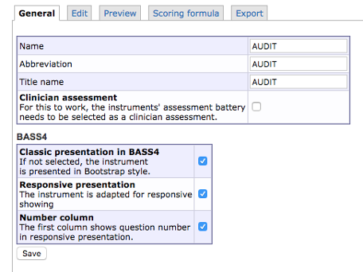

# Instruments

There are two ways to create a new instrument in BASS4. Either you can copy an existing instrument, that is similar to the one you wish to create and adjust that instrument. You can also create a new instrument from scratch, using the built in tool in BASS4.

## Copy an instrument
To copy an instrument, follow these steps: 
1) Navigate to **Instruments** in the main menu to the left. Here you can view all instruments currently available in your database. 
2) On the far right of the instrument you wish to copy, next to the trash can icon, is an icon resembling two documents. If you hover with the mouse pointer over this icon, it will say "Copy instrument". Clicking on this icon will create a copy of the instrument, called "Copy of [Instrument]".
3) Open the instrument you just created by clicking the pencil icon to the right on the instrument row. If you hover the mouse pointer over the pencil icon, it will display the tooltip "Edit instrument". Clicking the pencil icon will show the instrument editor. The "Creating a new instrument" section explains how this editor works.
4) Prior to editing the instrument, it's good practice to open a separate window or browser tab by using the **Preview-function**. This function is located under the Preview-tab, and opened by clicking the "Open preview in Clojure app" hyperlink. By default, a new tab will open where the instrument will be displayed in its formatted layout. It's a good idea to have this tab opened while editing the instrument in the instrument editor, and switching back and forth between the browser tabs to see your updates displayed in the Preview.

## Creating a new instrument
To begin creating a new instrument, navigate to **Instruments** in the main menu on the left. This will open up a table view showing you all the instruments currently available in your database. On the bottom of the table, there is a hyperlink with the text "Create new instrument". Clicking this hyperlink will take you to the **General** view of the instrument editor, as shown in picture 1 below. The tabs named **Edit**, **Preview**, **Scoring Formula** and **Export** are also displayed.

### The General Tab
This tab is where you can change the **Name** of the instrument, its **Abbreviation** (both of which are only show in the administrator's view), as well as the **Title name** (which is the title presented to the participants).
For example, this could be **Audit** in all three cases, as show in picture 1 below.

**Picture 1**

If the instrument you are creating is supposed to be filled out by a clinician, you check the box called **Clinician assessment**.

#### The BASS4 Table
This table contains three options that influence the presentation of your instrument.
**Classic presentation in BASS4** governs whether your instrument is shown in a classic layout, i.e somewhat smaller font size, or a more modern layout with a somewhat larger font size (16 pixels).
**Responsive presentation** governs whether or not your instrument is adjusted automatically according to the size of the screen it is viewed on (i.e mobile or PC/Mac). This mainly affects *Question* items, where answers ordered by cell will require additional steps be taken in order to display correctly.Instructions on how to do this are found under the "Edit" section. 
Answers ordered by line break will automatically display correctly both on mobile and PC/Mac with this option checked. 
Leaving this box unchecked will cause the instrument to display its PC/Mac layout regardless of which screen it is viewed on. It will not adjust to mobile screens.
**Number column** governs whether or not the first column of the instrument is assigned to the display of question numbers in responsive presentation.

When you've entered the information, click **save**.

### The Preview Tab
In this tab, you can view the instrument with it's final visual design applied (the final visual design is applied automatically by BASS) by clicking the hyperlink named "Open preview in Clojure app". 
By default, a new tab will open, in which the instrument will be displayed with its final visual design applied. It's a good idea to have this tab opened while editing the instrument in the instrument editor, and switching back and forth between the browser tabs to see your updates displayed in the Preview.

### The Edit Tab
This tab is where you create, or build, your new instrument. This is also where you adjust any instrument you've copied or want to edit. This is mainly done through adding, editing or deleting content in the form.
To begin, start by creating and defining a **table definition**

**Add table definition** 
By default, the first table definition is already created. However, it has not been defined, and thus you need to define it before proceeding to adding additional items and elements to your instrument. To do this, click the "Edit" text in the **Table definition** box. This opens up the editor for this specific item (in this case a table definition).
One thing to note before starting to assign **Cell width** is that the total width of your instrument is fixed to 700 pixels on PC/Mac. As such, you will have to stay within those confines when defining your table definition. 
If responsive presentation is used, the instrument width will adapt to a mobile screen size where applicable.

A table definition provides a layout framework for every item below it, up until the next table definition (if there is one).

A good practice is to allow the first column to take up 30 pixels of screen space. This is done by typing 30 into the first box of the **Cell width** column. If you so wish, you can justify the text of a box to be either left aligned, centered, or right aligned by choosing the corresponding option in the box's dropdown menu in the **Justify** column.
The second cell is most often reserved to the text of a question, and can be set to the desired width by typing it into the box.
Typing a * into the box makes its cell flexible, causing it to fill any left over width not claimed by the other cells in the table definition. If multiple cells are given a flexible width by typing * in their cell width boxes, they will share the left over width evenly.
The third through 16th cell is usually utlized for answers to a question item, when ordered by **Cell** (horizontally) and can be given any desired width. However, remember that width is limited if you are ordering answers by **cell**, and that long words in an answer may clip into eachother if the allocated space is too small.
Ordering answers by **line break** organizes them in a vertical structure, and as such they do not suffer this limitation. If you plan to order your answers by **line break** you only need to fill in the boxes for cell 1 and 2 in your table definition that governs the layout for the question items that utilizes **line break**

**Add information** 
Usually a form starts with information on how to fill it out, and as such you want to add that information before you add your questions. To do this, click "Add new [Free text]" and type the information ionto the "Free text" box.

In "Free text" you type regular HTML or regular text input. You can find some basic HTML tags in the appendix of this manual, with links to more thorough resources listed as well.
In "Layout-string", you type [T], which instructs BASS to render the text in the "Free text" box. Then press save.

>**Hint:** If you want to have a line above or below your text, to act as a separator, you can type in 1 in the "Border-width upper" or "Border-width lower", respectively.

**Adding questions** 
Depending on what questions you would like to add, you go about adding them in different ways. We will adress the most common type of question below.

**Adding multiple-choice questions** 
By follow the instructions below, your end result will look similar to this:

First, you will need to add a new "free text". To do this, click "**Add new [Free text]**". Then type in the options that are needed for the questions you want to add. For example, if you have five options to your question, you type it in like in picture 4 picture below.

**Picture 4**

If you have more options, you add them by typing "[TD] option 6", before the HTML tag `<!--desktop-->`. If you have less options, you delete the superfluous [TD] with accompanying text. The reason for the twin [TD][TD] in the beginning is to make empty space for the question you're adding later. The reason for the single [TD] between the options is to separate the options.

>**Hint:** ` ` is HTML and means that the rest of the text starts on a new row, i.e it implements a line break. If you want to have numbers on one row and the text under, you can add two   tags in between. If it's all supposed to be on the same row, you can omit including any ` ` tags.

Like in the "Free text" example, you type [T] in "Layout-string" to instruct BASS to render the text. Then decide whether or not you want borders above or below the text by typing in a numerical value in "Border-width upper" or "Border-width lower", respectively. Then click "Save".

Below the created "free text", you now click "**Add new [question]**". In the number box, you type in the number you want to assign to the question. In the "Question"-box you type in the question or statement.

By using the tools in the "Answer definition" section, you can define what type of answer you want. By default, "**Radio buttons**" is selected as the "Answer type". If you want multiple choice, you change the "Answer type" to "**Checkboxes**".
You can then fill out the different options under "label" (in this example you would use the same options you typed in "free text") and give them unique values under "value", see picture 5 below. The values are used to calculate the result with a scoring formula later on.

>**Important note:** The values for each answer option in a question *have* to be unique. If to answer options are supposed to have the same value, this is corrected for later on in the scoring formula.

When you've filled in your answer options and their unique values, you can choose "Cell" under the "Separator"-dropdown. In "Layout definition" you type in the following: **[N].[TD][Q][TD][X]**. This defines the layout for the question within the framework provided by your table definition. When this is done, click "Save".

>**HELP! What does [N].[TD][Q][TD][X] mean?** 

>- [N] Renders the number of the question in a cell. The period simply puts a period after the rendered number. 
>- [TD] Creates and empty cell 
>- [Q] Renders the text of the "Question" box in a cell 
>- [X] Renders the answer options in a cell 

The input in the "layout definition" box is read from left to right, and is applied in the same order. In the layout above [N] is rendered in the first cell, [TD] creates a space, [Q] is rendered in the second cell and [X] is rendered in the third through seventh cell.

>**Hint:** Make a habit of going back to your Preview page to see what your form looks like. This lets you correct mistakes and make adjustments as you go along.

>**Hint:** You can read about "optional", "inheritable", "jump", and "specification text" under "Extra information".

**Picture 5**