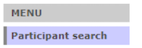
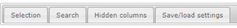
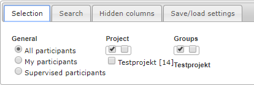
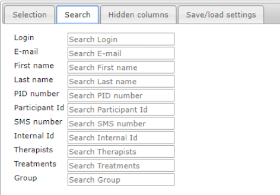
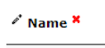
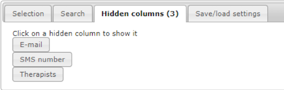
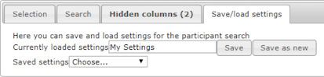
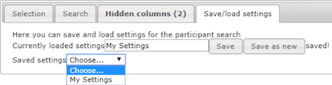
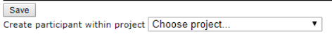

# Search participants: Finding what you need
The “Participant search” is located at the top of the main menu. This is where you can search for and list participants by specific variables such as groups or projects.

 

When you press “Participant search” you will see a view with four tabs:

 

- Selection – Add a filter to your search
- Search – Perform your search using text strings or other identifiers
- Hidden columns – View and show columns that are hidden
- Save/load settings – Save your recurrent searches for convenience

## Selection/filter
If you press Selection, you can add a filter to your participant search. 

 

Here you can choose if you want to search all participants, your own participants (that you treat) or participants whose treatments you supervise. 

You can also choose which project(s) or group(s) to search. The top two checkboxes can be used to quickly either mark or unmark all the below listed projects or groups. If no specific project or group is checked, all of them will be included in the search. This also means that unchecking all projects/groups won’t return participants without a project/group. 

>**Hint:** If you want to search a specific group you should only mark that group, and not the corresponding project, as this will return all the participants belonging to the project and not only those in the group. 

Your chosen selection of participants is shown in the participant list below the tab.

## Search
The actual search is done in the **Search** tab. If you previously added search filters in the Selection tab they will now be active and delimit your search. 

Here you can use many different variables to search for one or several participants. The search is executed either automatically when you leave a filled-in search box or when you hit the Enter-key on your keyboard. Your search results are shown in the participant list below the tab.

Note that there is a discrepancy when searching by numbers or by text strings:

- Searching for the number “12” will only show the exact hit, while adding a % sign to the search as in “12%” will return both “12”, “123” and “012”.

- Searching for the text string “my” will return both “My”, “Myra” and “Amy”. You don’t need to add any % sign for text string searches.

To search for several participants at the same time, you add a space between each corresponding search term in the search box. 

>**Hint:** This is useful if you want to search for participants whose IDs are listed on different rows in an Excel-file. Just copy the ID containing rows in Excel and directly paste them into the search box in BASS and they automatically receive a space between them.

## Hide, show and sort columns

If you want to hide a column, you hover the mouse over the column header until a red X shows up. By pressing the X, the column will be hidden. 

 

To show/unhide a column, press the “Hidden columns” tab.  This tab shows all hidden columns as buttons. Press the button with the column you want back and it will show up in the search results again.

Most columns can be sorted alphabetically or by number. To sort a column, press the small up/down arrows that show when you hover over the column header.

## Column explanations

There are a number of columns showing information, status or possible actions for a participant. Some are explained in the table below.

<table>
  <tr>
    <th>Column</th>
    <th>Description</th>
  </tr>
  
  <tr>
    <td>Pen symbol</td>
    <td>Edit the participant</td>
  </tr>
  
  <tr>
    <td>Participant Id</td>
    <td>A unique identifier for a participant within the study/project. “ANX-001”</td>
  </tr>
  
  <tr>
    <td>Internal Id</td>
    <td>A unique and technical identifier for a participant within the database.</td>
  </tr>
  
  <tr>
    <td>Flag symbol</td>
    <td>Shows if the participant is flagged for something.</td>
  </tr>
  
  <tr>
    <td>Message symbol</td>
    <td>Shows if there are unread messages from the participant.</td>
  </tr>
  
  <tr>
    <td>Chat symbol</td>
    <td>(For supervised therapists) 
Shows if there are unread messages from the supervisor.
</td>
  </tr>
  
   <tr>
    <td>Approval symbol</td>
    <td>(For supervisors) 
Shows if there are messages sent from a supervised therapist to a participant that might need approval.
</td>
  </tr>
  
   <tr>
    <td>Superv Mess</td>
    <td>(For supervisors)
Total number of messages in supervisory correspondence. This is a useful way to see how much guidance was needed from the supervisor.
</td>
  </tr>
  
<tr>
  <td>Last message</td>
  <td>Last date when a participant sent a message (was active). Sort on this column and you’ll find participants that are lagging behind.
</td>
</tr>
  
<tr>
  <td>Weeks</td>
  <td>The number of weeks left of the treatment. 
Treatments without end date are marked with the eternity symbol.
</td>
</tr>  

<tr>
  <td>Module</td>
  <td>The latest module the participant got access to. This column also shows for how many days the participant has had access to the module.
</td>
</tr>  

<tr>
  <td>Homework</td>
  <td>Shows if there is an unread homework sent in by the participant.
</td>
</tr>  

<tr>
  <td>Group</td>
  <td>Shows which group a participant belongs to. You can change the group here, but you need to save the update with the Save button below the list.
</td>
</tr>  

<tr>
  <td>Heart symbol</td>
  <td>By pressing the heart, you add the participant to your participants.
</td>
</tr>  

<tr>
  <td>Trash symbol</td>
  <td>By pressing the trash symbol, you delete the participant. Be careful as the participant and all its corresponding data then will be lost.
</td>
</tr>  

</table>

## Save/load search settings

To save your current search settings, including both filters and search parameters, press the Save/load settings-tab. First ensure that the current search result for the settings you want to save are shown in the table below. Then write a name for your settings in the Currently loaded settings box and press “Save as new”.

>**Hint:** Be careful to not use the “Save” button instead, because this will overwrite any currently loaded settings including its name. 

The text “saved!” appears to the right of the buttons and your search is now saved and available in the dropdown below. 

The dropdown “Saved settings” is where you access all your previously saved search settings. 

>**Hint:** If you make a new search, the “Currently loaded settings” box may no longer reflect the content of the search result list below. To be sure that the list matches the settings you want to load, first select “Choose” in the dropdown menu and then reselect the settings you want.

###	ADD NEW PARTICIPANT TO GROUP AND CHANGE GROUP

It is possible to directly create a new participant within a specific project. This function is found below the table of participants. Just choose which project you want to add the new participant to, and you will be redirected to the “New participant”-view with this project pre-filled.

It is also easy to change which group a participant belongs to. For each participant in the table, you can choose a project in the dropdown in the Group column. Don’t forget to save all changes by pressing the “Save” button below the table afterwards.

