# Participants {#participants}

The "Participants" view is one way to access participant information. It is very similar to the "Participant search" view, and it is mostly down to personal preference on which to use. You can customize "Participant search" to show exactly the data you want to see, while "Participants" is predefined and more simplistic. One important difference remains, however: the **"Groups"** tab, which only exists under "Participants".

Depending on which project is selected in the dropdown in the main menu, the result in the "Participants" view will differ. If a specific project is selected, only participants in that project wil be shown under each tab.

In "Participants", there are four tabs: 

- *My participants*, which shows you any participants assigned to you (as a therapist)
- *Supervisions*, which is similiar to "Supervised participants"
- *All participants*, which shows you all participants in a project. If no project is selected, it will show all participants in the database.
- *Groups*, which shows you the groups created in a project, and gives you the tools to manage them.

## Creating, deleting and editing participants
You can create new participants in two of the tabs in the Participants view; *My participants* and *All participants*. Participants that are created in the *My participants* tab will be tagged as your participants automatically, while participants created in the *All participants* tab won't be tagged.
To create a new participant, click *Create participant within project [Project Name]*. Newly created participants are added at the bottom of each view.

To delete at participant, click the trash bin icon to the far right of the corresponding participant's row.

To edit a participant, click the pencil icon in the table, on the corresponding participant's row. This will take you to the "Participant stats" view. 

If you only wish to change, or add, what group a participant belongs to, you can do so directly in the *Group* column of the participant table by using the dropdown. When you've assigned a participant to a group this way, don't forget to click the "Save" button at the bottom of the table.

## The participant view {#partview}
When you create or edit a participant, the participant view is shown. If you made any changes to the participant, don't forget to save them by clicking the "Save" button at the bottom of the page. To exit this view, and return to the participants table, click the "close" text to the right of the participant's name.

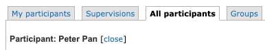

There are seven tabs in this view:

- *Participants stats*, where you can view all fundamental information on the participant
- *Treatments*, where you can view and manage any treatments connected to the participant
- *Files*, where you can upload files relevant to the participant. These files cannot be viewed by the participant, but only by therapist who have access to the participant.
- *External messages*, where you can manually send SMS or e-mail messages to the participant, and review the status on any previously sent, manual or automatic, external messages.
- *Flags*, where you can view and manage any flags the participant might have.
- *Assessments*, where you can view and manage assessments for the participant. You can also activate or deactivate individually managed assessment through this view.
- *Graphs*, where you can see graphs on the answers the participant has given on recurring assessments. The graphs do not show individual items but only sums and sub-scales defined in the instrument scoring.

### Participant stats {#participantstats}
This view shows information about the participant, such as ID-numbers, name, the therapist assigned to the participant (if any), any notes on the participant and more.<vbr>

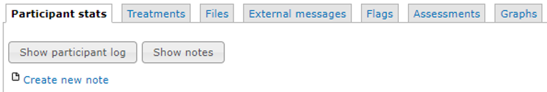

The *Show participant log* button on the top of this view will show a log of all changes and updates done to the participant.

The *Show notes* button will show a log of all notes written aout the participant. 
Notes on a participant can be added by clicking the *Create new note* link. 

>**Important note:** Prior to doing this for the first time, make sure to add at least one note category through the **Note categories**, accesssed from the main menu. Example of note category definition is
 
`01:Telefonsamtal`
 
`02:Anteckning`

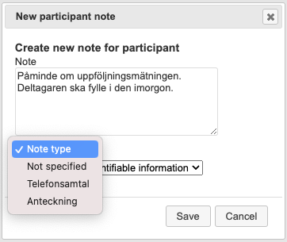

**Stats**

The *Stats* box shows data such as how many times the participant has logged in and which privacy consent was approved and when. *Internal ID* is the identification number of the participant used by the database.

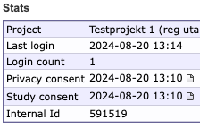

Click the document symbol next to the consent date to see exactly what text the participant consented to.

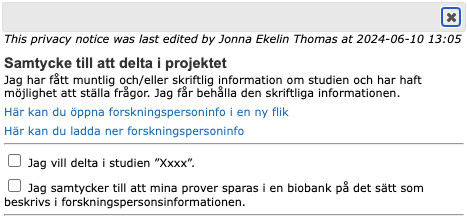

>**Important note:** It might look like the participant has not given their consent as the checkboxes are not marked. The reason for this is that this view only renders **what** was defined in the study consent field (in Registration options) at the time of the consent. The study consent step can however only be completed by checking ***all*** checkboxes presented, and only then is a date for the consent saved on the participant.
See more information on how to set up the consent in **Chapter \@ref(registration)**.

**User information**

User information can be edited in the *User information* box.

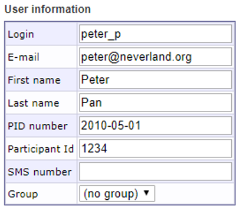

**Password**

Existing passwords ***cannot be retrieved***, only cleared or changed. If a participant reports a lost or forgotten password, you can provide them with a link to reset and change their password by clicking the *Send password link* button. You can send it by email or SMS, and add a personalized message as long as you don't remove the {LINK} from the Message box. 
 
If using quick login, it is also possible to generate new quick login codes, and to send them by SMS, from this view, see below.

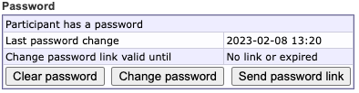
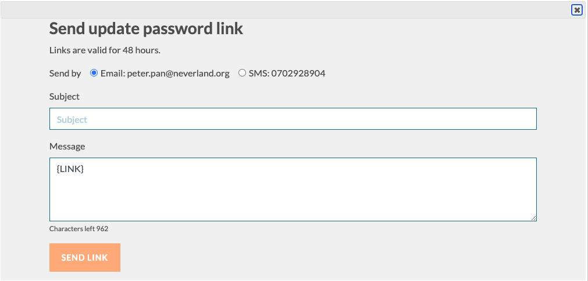

**Two-factor authentication method**

The avalable choices are determined by the settings in the main menu *Project Security*, see **Chapter \@ref(projectsecurity)**.

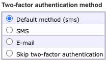

>**Important note:** *Exempt from two-factor authentication* must be enabled under **Project security** in the main menu. Only participants can be exempt from two-factor authentication. It is mandatory for therapists.

**Quick login**

Here you can see if a participant has an active Quick login code and when it will expire. They should be renewed automatically when assessments are activated. See ***Chapter \@ref(automaticreminders)*** for information on how to ensure this. However, it is also possible to generate a new quick login code manually if needed. Do so by clicking *Generate new code*  which generates code but do not send any notification to the participant, or by clicking *New code by SMS* which generates a new code and sends it to the participant in one go.

>**Hint**: For easy use of the *New code by SMS* functionality, make sure to first define a standard message for this in the main menu **External Messages** > field **Standard SMS with quick login code**. Also make sure that this standard message includes the tag {QUICKURL}. See ***Chapter \@ref(extmess)***.

>**Important note:** Quick login settings are enabled and managed under **Security settings** in the main menu. See ***Chapter \@ref(securityparticipants)*** for more information on what it is and how to use it securely.

**Temporary fields**

The *Temporary flag text* box provides you with the possibility to flag a participant with a star icon, that will display next to their name in the participants table. You can add a comment on why you flagged the participant.

The *Temporary notes* box provides you with the possibility to add a temporary note on the participant - this note is also saved in the participant log if your click the "Save" button.

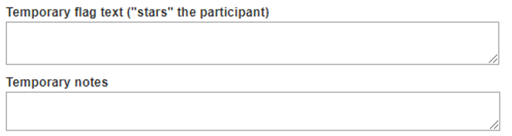

**Assign participant to therapists** 

This table allows you to assign the participant to another, or several other, therapist(s). The number shown in brackets to the right of each therapist's name displays how many participants are already assigned to that therapist. This is useful for when you want to assign participants equally to the available therapists. 
Remember to click "Save" to save your changes.

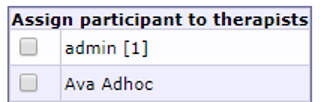

**Move participant to another project**

You can use the dropdown menu on the bottom of the page to move the participant to another project. This will move the participant to the project of your choosing, and close the tab. If you want top view the participant again, you will need to navigate to the destination project before being able to do so.

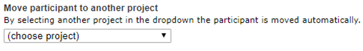

### Participant treatments {#parttreat}
To assign a participant to an existing treatment, go to **Participants**, **Treatments**, the **Treatment access** tab. All available treatments are listed here in the dropdown menu.

If a treatment doesn't show up in the dropdown menu, you will have to make it available via **Treatment containers** in the main menu.

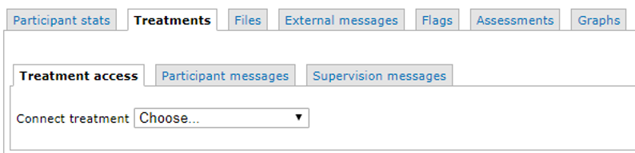

>**Important note:** While it technically is possible to assign several treatments to the same participant via the admin interface, the participate will only be able to access *__one__* of the treatments at a time. 

When the treatment is connected you can adjust the default treatment settings for a particular participant, and for example disable and enable modules.

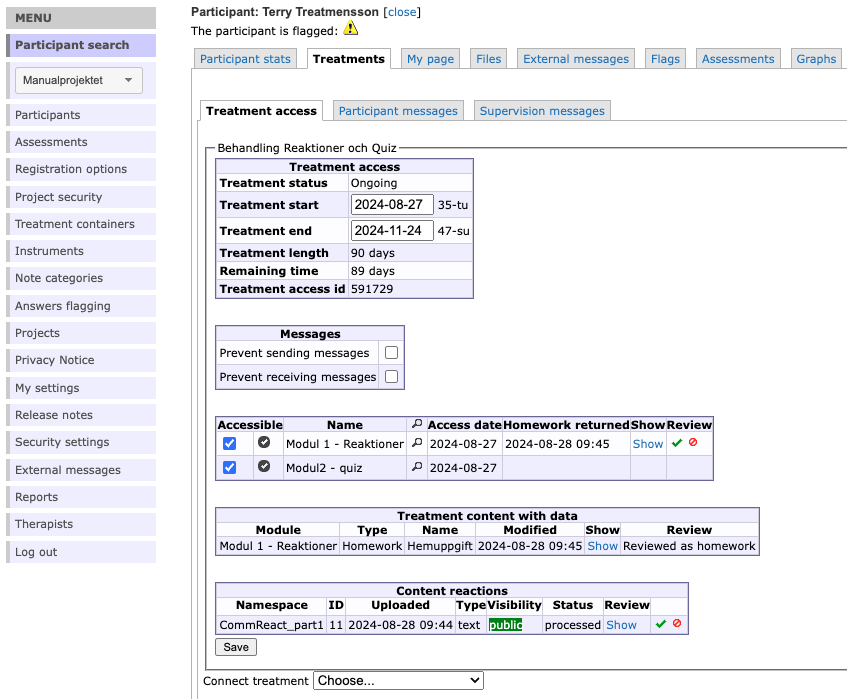
This view also lets you see how the participant has interacted with the treatment modules. You can view any data that the participant has provided in the treatment modules by clicking *Show* in the different tables. 

For homework content you can mark them as reviewed (*green checkmark*), or return the homework to the participant (*red circle with diagonal line*). 

If you are using *community content reactions* in your treatment, you need to approve reactions (*green checkmark*) in this view before they get visible to other members of the participant's group. The participant will not be informed whether the reaction har been approved or not.

>**Note:** Reviewing or returning homeworks do not notify the participant. Any comunication around homeworks or other treatment content need to be manually handled with chat messages in **Participant** > **Treatments** > **Participant messages**.

>**Note:** Reactions that need to be approved will show up as homework in the Participant Search list. For more information on *Content reactions* see ***Chapter \@ref(treatmencontenttext)***

**Participant chat messages**

To write messages in the participant treatment chat go to **Participants**, **Treatments**, the **Participant messages** tab. Here you can send messages and also read answers from the participant. These chat messages will appear in the messages menu for the participant when logged into the treatment.

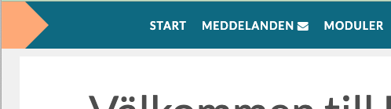

>**Note:** Setup for how the participant is notified of these chat messages can be done in the main menu *External messages*, see ***Chapter \@ref(extmess)***.  

>**Note:** When a participant has sent a message in the chat, this can be seen in the participant list views and is indicated by a letter icon.

In some studies, you may want to record how much time is spent writing messages to participants by a therapist. This functionality needs to be activated for each project. Go to **Projects** in the main menu, and check the *Timing* column to do so.

When this functionality is enabled you will be presented with e slightly different view when writing chat messages in the participant treatment. 

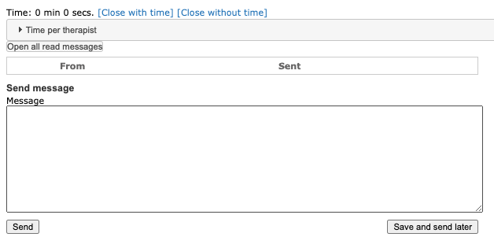

When you have written and sent your message you can choose to *close with time* (i.e. have the time you spent on the participant recorded) or *close without time* (not save any additional time for this interaction). If you close *with* time, you will also be able to adjust the time you spent.

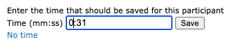

> **Hint:** For information on viewing data regarding time per therapist, See ***Chapter \@ref(reportstreatinfo)***.

**Supervision messages**

The tab **Supervision messages** can be used by a therapist and the therapist's supervisor to discuss the treatment for the patient. They can add notes and send messages to each other. These are only visible in the admin interface and not to the participant. This view also displays the chat messages with the participant for easy access.

> **Hint:** For information on notifications for supervisors, See ***Chapter \@ref(searchcolumns)***.

### Participant External messages {#participantextmess}

### Participant Assessments {#participantassessments}

