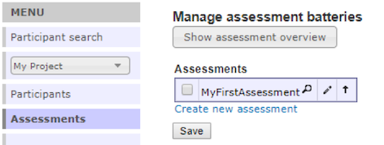
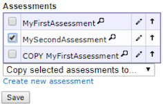
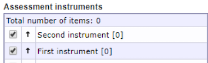

# Assessments
Assessments are accessed from the “Assessments” option in the main menu. Note that you first have to choose a project in the dropdown in the main menu to make the Assessments option for that project visible. When you press “Assessments” you will see a view showing the existing assessments of the chosen project. All assessments that are listed in this view can be manually sorted with the upwards pointing arrow symbols to the right of each assessment name. 

You can show or hide the expanded overview by pressing the Show assessments overview-button. Here you can get a quick review of all the included assessments and their corresponding attributes. 

**Hint:** Among other things, the assessment overview shows the order of each instrument in all assessments. This is a good place to ensure that the instrument order is kept from one assessment to another throughout the project. It also enables you to easily see if you somewhere have missed to include an instrument that should appear in several, similar assessments.

## Create or edit assessments
Add a new assessment to your project by pressing “Create new assessment” at the bottom of the Assessment view. To instead edit an existing assessment, press the pencil symbol to the right of the name of the assessment you want to edit. This opens up the assessment panel where you can set a number of variables that define the assessment: 

### Name 
Here you can fill in a name for your assessment, for example ***Screening***. 

### Label/Custom label 
You can either select one of the predefined labels in the drop-down, or write your own label in the Custom label textbox. Adding a custom label will surpass any predefined label that is selected from the drop-down. Note that the assessment label will be visible in reports when you export your data.

>**Hint:** By selecting Weekly-assessment or Point-assessment some stats for Repetition (below) are preset. 

### Managed 
This option sets whether data-gathering is managed individually or in groups. 

>**Hint:** If you have different cohorts, you may want to choose In group. Screening assessments are usually managed In group and these can be activated or deactivated for a certain group and date under Participants -> Groups -> screening group name -> Show -> Assessments. 

>**Hint:** If your participants start their assessments at different times, you usually choose Individually. The Individually option is also more flexible for long-term studies spanning over months when participants go for vacation and need some individual adjustment to the timing of assessments.

### Repitition 
The Repetition option sets if the assessment is to be done once or repeatedly, and if so at what intervals and for how many times. 

Assessments with the predefined label “Weekly” have repetition set to Weekly and the interval to 7 days. 

Assessments with the label “Point-assessment” have repetition set to Manual. This means that the next assessment can be set manually to occur at an arbitrary date, independent of the time of the previous assessment. This is useful for assessments that are triggered by irregular events, for example a major flair of symptoms. *Note that this setting (label: Point-assessment or repetition: Manual) is difficult to use correctly. We do not recommend using this setting*.

### Time limit 
Here you can set if participants have to fill out the assessment within a certain time limit. 

>**Important note:** Setting a time limit for an assessment is extremely important to prevent the results being mixed up with those from similar, subsequent assessments. For example, if an ongoing POST assessment is still accessible when the FOLLOW UP assessment is activated, the results of any of them is duplicated to the other. This results in data reports where no change seems to have occurred between the assessments.

An assessment with the time limit of 7 days that starts on a Monday will be available for the rest of that week but not for the next. 

>**Hint:** Keeping the time limit short, or shorter than the repetition interval, has the effect that participants fill in correct data corresponding to the set time-frame, but sometimes will miss the window when they can report. This is useful in assessments where accurate and time-dependent data is more important than full attendance.

###	Dependence
The Dependence option sets when the assessment is to be activated, in relation to the date of a previous assessment. The relationship is kept even if you change the date of the previous assessment. 

Date offset from is where you select the previous assessment from which the date/delay is to be calculated. 

>**Note:** Setting Date offset from a reccurring assessment (i.e. WEEKLY) will count the delay from the date of the last assessment and not the first. If this is not what you want, consider creating a dummy assessment without instruments to hold the start/dependence date.

Checking Dynamic means that the delay is calculated from the time when the previous assessment was completed instead of the time when it was scheduled. Note that this setting only can be done on individually managed assessments.

Delay is the number of days to wait before activation. 

>**Hint:** If you can’t see the calculated date of your assessment in the view under Participants -> Groups -> group name -> Show -> Assessments, try to set the date of the previous interrelated assessment again and press the Save button.

### Clinician rated

This option hides all instruments in the assessment for participants and instead enable clinicians to fill in the associated ‘clinician rated’ instruments via the administration interface.

This setting allows a clinician to fill in the instrument(s) for a specific patient via Main menu -> Participants -> Groups -> specific group -> specific participant -> Assessments -> specific assessment -> specific instrument -> pen on document symbol

>**Note:** Clinician rated instruments should not be added to self-assessments. Clinician-rated instruments are hidden for participants which makes it impossible for the participant to complete an assessment containing such an instrument.

>**Hint:** Clinician rated assessments won’t send automatic reminders. An option is to use flags instead to mark undone tasks.

### Randomize instrument order
With this option you set the order of the included instruments to be randomized. If not set, the order in which the instruments appear in the assessment will be the same as the order they are presented in the box Assessment Instruments shown to the right.

### Welcome/Thank you text 
Here you write messages formatted in either Markdown or HTML that you want to show to participants before (welcome) and after (thank you) they fill in the assessment.

### Concurrent and merged assessments 
With this option you can set the order in which coinciding assessments appear to participants.

If two or more assessments can coincide, you may want to set in which order they appear to participants. This also affects the order of the Welcome/Thank you-messages. The assessment with the lowest number has the highest priority and is shown first. The other assessments and their Welcome/Thank you-messages will follow corresponding to their respective priority order.

The ***Merge assessment…*** box sets if an assessment is to be integrated as a part of (after the Welcome text and before the Thank you text) a coinciding, higher-prioritized assessment. Setting this option means that the current Welcome/Thank You-messages are not shown at all on coincidence, but only when the assessment occurs alone or simultaneously as lower-prioritized assessments. 

The ***If merged*** – Show… box sets if Welcome/Thank you-messages are to be shown even on coincidence as per the Merge assessment setting above. Note that it can be tricky to write messages that work both standalone and together with/as part of other assessment messages.

### Automatic reminders 
This option sets notes or reminders to automatically be sent to participants on certain events. The basic functionality is that a note is sent the same day as an assessment becomes available. With the check boxes you can choose which media to use, mobile text messages (SMS) and/or email. 

*Create new quick login* needs to be checked if quick logins are to be sent with the reminders. 

>**Hint:** Remember that you also need to activate quick login under Security Settings in the Main menu to enable this function.
You can also add reminders to participants who are late with filling in their assessments.

>**Note:** It is not possible to only send reminders to participants that are late with filling in their assessments, you always need to activate availability notes too (by checking either of the sms/email boxes) for this extra functionality to be enabled.

*Remind interval* is the delay upon which reminders are sent to late participants, counted as days after the assessment became available. 

*Max number of reminders* sets how many reminders can be sent out to the participant, with the previously mentioned time interval. This setting needs to be at least 1 for any reminder to be sent.

>**Hint:** If you want additional reminders to be sent, increase the number in this box instead of rescheduling the assessment (see below)

>**Note:** Postponing an assessment that has automatic reminders to the future will neither make any new availability notes to be sent out, nor make any additional reminders to be sent out (because BASS counts the number of sent reminders independently of assessment date). Rescheduling an assessment that has automatic reminders to the past will disable the availability note (because the first day of availability has passed) and eventually disable reminders if the remind interval for them has passed.

*Use standard text for e-mail/SMS* – Sets the content of reminders/notes to be sent to a predefined standard text. The current standard texts are shown below the checkbox.

>**Hint:** The standard texts for reminders and notifications can be edited via Main menu -> External messages. 

It is also possible to set a *Custom notifications/reminders* text in the corresponding textbox. This text is shared between emails and SMS. The *Subject for activation* emails and SMS can however differ and are set in the two bottom textboxes. Custom notifications/reminders can be up to around 150 characters long. 

### Participant flagging 
This option sets flags to be shown for therapists on certain, participant-specific events.

*Flag participant when assessment becomes activated* raises a flag for participants at the activation of the assessment. 

*Flag late participants* raises a flag for participants that haven’t filled in an assessment within a certain number of days after it became available. You can set the number of days to wait before flagging in the box labeled *Days until participant is flagged late.* If an assessment is late, a flag will immediately be shown on the participant in question in the overview pane under **Participants**.

## Copy assessment 
You can create a copy of an assessment and save it to the same project before editing it. This functionality makes it quick and easy to create several similar assessments that occur at different time points within your project.

It is also possible to mark several or even all assessments of a project and copy them to another project, thus creating two similar projects.

To copy assessments in the Assessment view, check the boxes of the assessments you want to duplicate. This makes the dropdown menu Copy selected assessments to… appear below the assessment list. From the dropdown you can select the project where you want to paste the assessment. If it is the current project, the copy-pasted assessments will appear at the bottom of the list with the prefix COPY.

## Dummy assessments - some scheduling tricks 

Empty assessments that doesn’t contain any instruments can be used as timers to schedule administrative activities. 

**Example 1, Scheduling automatic events:** A single, empty assessment can be created to hold the time point from which other assessments are scheduled to automatically become available. This circumvents the issue when a “real” but reoccurring assessment can’t be used as starting date for a timetable. 

**Example 2, Scheduling manual actions:** An empty assessment can also be used together with flagging to prompt a certain action from the therapist. This is useful when something needs to be manually sent or done by the therapist a certain number of days into treatment while participants have individual treatment start dates. The trick is achieved by creating an empty assessment (i.e. FLAG FOR SENDING DEVICE) that is dependent on a previous assessment (i.e. FIRST ASSESSMENT) and activated with a chosen delay (i.e. 63 days after). By checking the box Flag participant when assessment becomes activated, the therapist will see individually occurring flags on participants whenever it is time for them to receive the attention/service from the therapist. Since the assessment doesn’t contain any instruments, only the therapist will get a notice (flag).

**Example 3, Scheduling text messages (SMS):** An empty assessment that is managed In group and linked to a text message can be used to schedule an independent reminder to all participants (i.e. “Happy New Year! If you find it hard to keep to your new lifestyle during events like this, log in and re-read the advice in module 3”). An empty assessment can also be created to remind a single individual that hasn’t done so for a while to log in.

## Assessment instruments 
All available instruments are listed in the right panel of the Assessment view. To include an instrument, check the box to the left of its name and then press the *Save* button. The number shown between the brackets to the right of each instrument name shows how many questions the instrument contains. The *Total number of items* top row shows the current total sum of questions in the assessment. 

The order in which the instruments appear in the assessment will be the same as the order they are presented in the box Assessment Instruments shown to the right. You can change the order of an instrument listed in the box by pressing the upward arrow to the left of the instrument name. 

>**Hint:** If you can’t see any/all arrows, first select the instruments you want to include and press Save. Then change the order of the instruments and press Save again
