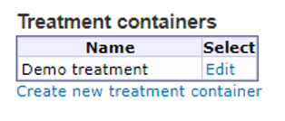
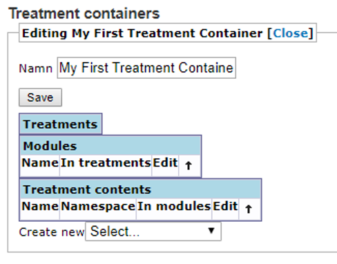
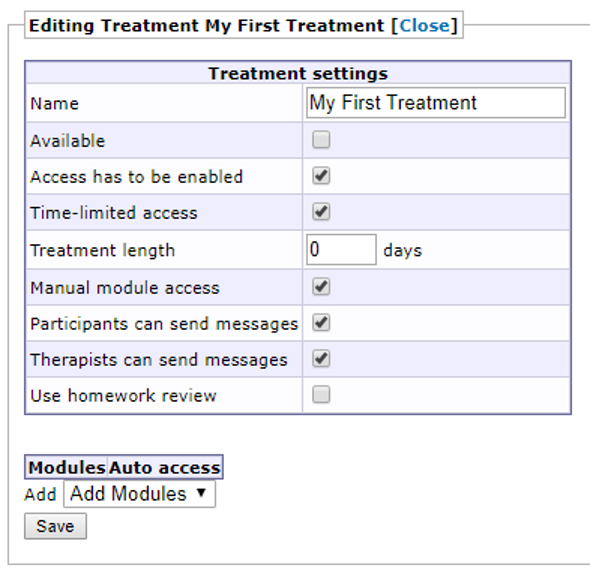

# Create new treatment 

BASS is designed to allow you to conduct mental healthcare and psychological studies through online channels. The main feature to achieve this in BASS, is the treatment.<br>
A treatment is built by combining *treatment modules* into sections. A module is in essence a website, contained within the framework that BASS provides. This allows you the flexibility to build your treatment according to your organization's needs and wishes.

Treatments are accessed by the **Treatment containers** option in the main menu.

The first thing you will see in this view is a table showing you all the existing treatment containers in the current project. If no treatment containers have been created, the table will be empty.<br>
You can edit existing treatment containers by clicking the *Edit* link in the column to the right.<br>
To create new treatment containers, click the *Create new treatment container* link below the table.



>**Important note:** *Treatment containers* in BASS are frameworks that contain all the other components that make up a treatment, such as treatment modules.

## A typical treatment structure
A **treatment container** is the abstract structure that holds all the content of a treatment or treatment series. A typical **treatment** is built up by several modules, often arranged in a specific order. A typical **module** consits of:

- One *module text*
- (0 - several) *worksheets*
- One *homework*

Whenever you create a new treatment, it is advisable to plan the structure from the beginning, so as to get a sense of both the magnitude of the sub-content and the flow of the treatment.

## Creating a treatment container
In the **Treatment containers** view, click the *Create new treatment container* link below the table. This opens the editing view of the new treatment container. You can close the container by clicking *Close* at the top to return to the table listing all existing treatment containers. Don't forget to save any changes first, by clicking the *Save* button.



Give your treatment container a name in the *Name* box, and save it.<br>
You can now add treatments, modules and specific contents such as texts, worksheets and homeworks to your treatment container, by using the dropdown menu at the bottom of the page.

## Creating a treatment
Regardless whether you just created a new treatment container or chose to edit an existing one, you can add a new treatment to it, by selecting *Create new... [Treatment]* in the dropdown menu ar the bottom of the view. This opens the editing view of the new treatment. You can close the treatment by clicking *Close* at the top of the view to return to the corresponding treatment container. Don't forget to save any changes before doing so, by clicking the *Save* button.

Give your treatment a name, by typing it into the *Name* box and save it.



Before adding in modules with content to the treatment, there are a few **Treatment settings** to consider.

**Available**
By checking this box, the treatment can be assigned to participants.

>**Important note:** Any participants assigned to the treatment will automatically and continuously have access to all its content unless you limit the access with the settings below.

**Access has to be enabled/time-limited access**
If the *Access has to be enabled* box is checked, the treatment has to be manually activated for a participant before its content becomes available to that participant.

By also checking the *Time-limited access* box, you can specify a time window for a participant when the treatment is active and its content available. This time window is specified in the participant view, under the **Treatments** tab.

**Treatment length**
If the treatment is to be available for a certain numbre of days after it has been activated, you can set that value in the *Treatment length* box. You can always override/customize the treatment availability for a specific paricipant in the **Treatment access** tab of the participant.

**Manual model access**
Check this box to be able to activate each module in the treatment separately for a participant. This is useful for when you want to make sure participants are finished with one module before starting with the next one.

**Participants can send messages**
Checking this box makes it possible for participants to send messages to their therapists during an active treatment, by using the built-in messaging feature in BASS.

**Therapists can send messages**
Checking this box makes it possible for therapists to send messages to their participants during an active treatment, by using the built-in messaging feature in BASS.

**Use homework review**
Checking this box has two implications:

- First, a participant can choose to either save a homework (to be able to work on it later), or send it to the therapist (which marks it as finished and locks it, disabling further editing).
- Second, an icon will be displayed i the *Homework* column of the *Participant search* view, that flags whenever a participant has submitted a finished homework and thus notifies the therapists of the fact at a glance.

**Modules**
This is where you connect modules to your treatment. If you have not yet created any modules this will be empty, without any modules to choose from.
If you’re working in an established database with pre-existing treatment modules, they will show up in the dropdown menu. Click on a treatment module to add it to your treatment.

**Pages**
This option lets you add a *treatment content* as a separate menu page in the participant’s view. For example, this could be a sleep diary which the participants are to work with for the duration of their treatment, or any similar worksheet that is not part of any particular module. It may also be an instructions page, or a page with a collection of links to downloadable treatment content, such as a PDF document.

**Welcome screen**
Here, you may type in content to show a custom welcome screen/home page in the participant’s view. There are a handful of instructions given on the page itself, to show conditional text or content.
For example, by using the `<ongoing>*YourContentHere*</ongoing>` tag, you can specify the content enclosed in that tag to show when the treatment is ongoing. This is, in essence, the standard text for your home page.
By using `<daysleft>*YourContentHere*</daysleft>` you can set content to show only as long as the participant has more than one day left of the treatment. When that time has passed, this content will not be shown.
By using `<lastday>*YourContentHere*</lastday>` you can set the content to only show on the last day of access. This might be a thank you and/or good luck text, or something similar or appropriate for your treatment.
By using `<limited>*YourContentHere*</limited>` you can set content to only show when the participant has only limited access to the treatment. For example, this could simply be a text informing the participant of the limited access and the changed it entails.
Using `<limiteddaysleft>*YouContentHere*</limiteddaysleft>` you can set conditional content to be shown as long as the participant has more than one day left of their limited access.
Using `<limitedlastday>*YourContentHere*</limitedlastday>` you can set conditional content to be shown on the participant’s last day of limited acces, such as thanking them for their time and effort, and whishing them good luck.


## Treatment Modules
Now, let’s create modules for our treatment. To do this, click *Close* at the top of the page to exit the treatment settings and return to the Treatment view for your treatment. Here, click the dropdown menu at the bottom of the page and select Module. You will be taken to the settings page for the module. Here, you can give it a name, and tags if you wish. Below these two boxes, there are three dropdown menus:

1. **Main text** is where you assign a treatment content to be the main text of the module. This is usually the instructions, a psycho-educational text and other information relevant to the module.
2. **Worksheets** is where you assign a treatment content to be a worksheet connected to the module. You can assign multiple worksheets to a single module. Worksheets can be worked with and iterated upon by the participant.
3. **Homework** is where you assign a treatment content to be the homework of the module. You may only assign one homework per module. Homework can not be iterated upon by the participant once it has been submitted for review and subsequently approved by the therapist. If the therapist returns the homework to the participant, they’re able to make changes.

If you're working in a newly created databasa, leave the main text, worksheets, and homework dropdown menus empty, since there is no *treatment content* to assign yet.
If you’re working in a pre-existing treatment with completed *treatment content* ready for use, add them as appropriate.
Click *Close* at the top of the Module settings page to close it and return to the treatment overview.

## Treatment Content
So, let’s create some treatment content to add to our module. The treatment content is where most of the work goes into treatments. This is where you add text content, media content, forms and other input fields. You have a large degree of freedom to design your own treatment content and you can have it be as simple or as advanced you want or your knowledge of **HTML**, **CSS**, and if you’re an advanced user, **JavaScript** dictates. We will be including some templates of the most commonly used **HTML** in this manual that you can copy and paste into your treatment content. To build a “complete” module with main text, one worksheet, and a homework, we’ll need to create three separate treatment content units.

We will start by creating the main text one and work onwards from there in a “bottom up” fashion where we lay the foundation first, and add the complementary content when that’s done.

1. So, to add a treatment content navigate to your treatment if you’re not already there. From the Create new dropdown menu at the bottom of the page, select treatment content. This will take you to the settings and editing page of the treatment content. Start by giving it an appropriate name in the box labeled Name at the top, and click *Save*.
2. You may add tags if you wish, to make the content searchable.
3. *Data namespace* is recommended to leave as is (auto-generated) unless you have a clear and specific reason to change it. The name space is used by BASS to identify the treatment content and save the information contained within in.
4. *Path to file* lets you assign a file to be the content of the treatment content instead of a text. By clicking the Browse server button you will be taken to the internal file manager of your BASS database, from where you can set up a folder structure. This server browser is somewhat limited in comparison to the insert link version in that you cannot upload any files through this version, only select already existing files to link to.
5. *Show example content* lets you fill in a worksheet example to see how a worksheet is built in BASS. Click Fill in example in BASS4 below to view an example version of a worksheet from the participant point of view.
6. *Use markdown+HTML (else only HTML)* lets you decide whether to use HTML and Markdown for formatting, or only **HTML**. We recommend leaving this checked, unless you’re confident in your **HTML** skills and do not wish to have any Markdown syntax potentially interfering in your **HTML** code.
7. Navigation mode is a new option added to treatment content that lets you select the manner in which your content is presented. Click the corresponding radio button to select the mode you wish to use.
    - *Indexed by H1 tags* is the default option and presents the content as a long continuously scrollable page. You can visually divide it into cards by using the **HTML** tag `<h1>YourHeading</h1>`, or by using the Markdown syntax #YourHeading. 
    - *Split into pages (use `\PAGEBREAK` at the top level)* lets you divide the content into individual pages, PowerPoint-style. As per the instruction in the option text, use `\PAGEBREAK` where you wish to insert a page break and switch to a new page.

8. Content can be completed multiple times using tabs… lets you use the div element with class=”tabbed” as following `<div class=”tabbed”>*YourContent*</div>`, to have for example a weekly diary be repeatable beyond the first week, without having to set up 10 individual weeks by coding them by hand. The participant can simply click a plus sign to add a new tab, with a fresh week ready to be filled in.

### Content text
Content text is the main editing window where you add the text, media content, forms and input field etc. to your treatment content. This is all formatted and structured through **Markdown** and/or **HTML**.
A few things are worth knowing when working with **HTML** in BASS:

1. You do not need to define the document type (`<!—DOCTYPE HTML -->`)
2. You do not need to use `<html>`, `<head>`, `<title>` or `<body>`.
3. You do not need to define any **CSS** styles, since BASS has its own **CSS** sheet that will be the standard design for your treatment content. If you do want to have custom **CSS** styles for part of your treatment, you can use the `<style>` tag to insert those **CSS** rules and apply them. Do note however, that you may only apply **CSS** styles to elements within your treatment content. You cannot apply styles to BASS itself.

Now, creating content is as simple as starting to type into the edit box. It may seem daunting at first if you are unfamiliar with **Markdown** and **HTML**, but there are several good resources available on the web. 
One good resource for Markdown is found here: [https://www.markdownguide.org](https://www.markdownguide.org).
A good resource for HTML is found here: [https://www.w3schools.com](https://www.w3schools.com). 
If you want to perform advanced actions, such as automated calculations using user input as variables, you will need to learn some **JavaScript**, and add it to your treatment content with the `<script>` tag.

A typical start of a module main text may look as follows when written in **Markdown**:

```markdown
“# Welcome to your treatment!

This is a ten-week treatment during which we will work together and learn about your symptoms and diagnosis. We will begin this week with psycho-educational material, and continue with some practical breathing exercises. The module should take about 20-30 minutes to complete. It is important that your read all the instructions carefully so that you feel you understand completely. Should you have any questions you are welcome to send us a message by using the “Messages” feature at the top of the page.
If you encounter any errors, please use the “Problems?” feature on the top right hand side.

Your treatment is divided into ten weeks, with a new module each week. Talk to your therapist if you feel you need to go slower. The modules are as follows:
- Module 1, start and information
- Module 2
- Module 3
- Module 4
- Module 5
- Module 6
- Module 7
- Module 8
- Module 9
- Module 10, finish”
```

The same main text written in HTML would look like this:

```html
“<h1>Welcome to your treatment!</h1>

This is a ten-week treatment during which we will work together and learn about your symptoms and diagnosis. We will begin this week with psycho-educational material, and continue with some practical breathing exercises. The module should take about 20-30 minutes to complete. It is important that your read all the instructions carefully so that you feel you understand completely. Should you have any questions you are welcome to send us a message by using the “Messages” feature at the top of the page.
If you encounter any errors, please use the “Problems?” feature on the top right hand side.

Your treatment is divided into ten weeks, with a new module each week. Talk to your therapist if you feel you need to go slower. The modules are as follows:

<ul>
  <li>Module 1, start and information</li>
  <li>Module 2</li>
  <li>Module 3</li>
  <li>Module 4</li>
  <li>Module 5</li>
  <li>Module 6</li>
  <li>Module 7</li>
  <li>Module 8</li>
  <li>Module 9</li>
  <li>Module 10, finish</li>
</ul>”
```

Here we’ve used a heading (`#` in **Markdown**, `<h1>` in **HTML**), then written some informative text, and finished with an unordered, i.e non-numbered, list (`-` in **Markdown**, `<ul>` and `<li>` in **HTML**). You can create ordered, i.e numbered, lists by using numbers in place of the dash in **Markdown**, or using `<ol>` in place of `<ul>` in **HTML**. Refer to the guides and tutorials linked above for further information on syntax and formatting in **Markdown** and/or **HTML**.

Below the edit box are three buttons. The *Save* button does what it says on the tin: it saves your work. Make a habit of saving often.
Then there are two more buttons: *Insert link* and *Preview*.

The Preview button will preview your saved treatment content, to give you an idea of how it will look to the participants. It’s very useful for checking that your design looks as intended, and as a quick way to check your progress. We recommend that you also create a dummy participant for which you activate your treatment, so that you can log into that participant account and check that your treatment works and looks good “live”, so to speak.

Note that when you click *Save*, your Preview window will be emptied. Simply click *Preview* again to show your preview.
The *Insert link* button will take you to the file manager in BASS once clicked (the file manager will open in a new browser tab). Here you can upload images, audio and video files, documents and so on, to be used in your treatment content or be made available to download for your participants. At the top of the page you will see the file path you’re currently in.

It is good practice to set up an easily navigable folder structure before you start uploading any files. Click the *Create new folder* button at the bottom of the page to create a new folder. Note that any new folder you create will be created within the folder you’re currently located in (i.e if you’ve created folder A and then navigated/clicked into it and create folder B, folder B will be created within folder A). The reason we’re doing this in advance is that you cannot move files around once they’ve been uploaded, so it is important that they are uploaded to their proper place from the start.

Once you’ve set up your folder structure, make sure you are in the folder you want the file to be uploaded to, and go to the lower edge of the screen and click *Välj fil* (Swedish for Select file). This will bring up a file browser, showing local files on your computer, where you can navigate to and select the file you want to upload from your computer. Once you’ve found the correct file, select it and click *Överför* (Swedish for Transfer, or Submit). You may also double-click the file. Once you’ve done so, you will be back at the file manage in BASS, and can see the name of the file you’ve selected for upload at the bottom of the page. If it is the correct file, go to the bottom right corner of the window and click Upload. Depending on the size of the file, this might take a moment. When the upload is finished, your file will be visible in the file manager window. Simply click it to add its file path to your treatment content.

Now, depending on the type of file you’ve uploaded, you will need to use different **Markdown syntax** or **HTML tags** to have to show in your treatment content.

If it is an image file, you will need to use the following Markdown syntax:
``

If you’d rather write HTML, you use the following tag:

```html

```

The “image.png” is used here as a placeholder for the file path to your image. As such, it should be replaced and will look something like this: `File.php?uploadedfile=/[file path to your image]`.

If it is an audio file, you will have to use **HTML** since **Markdown** does not handle audio files.

```html
<audio controls>
  <source src="audio.mp3" type="audio/mp3">
</audio>
```

As with audio, **Markdown** does not handle video files so you will have to use **HTML** for video files as well. The **HTML** is similar to that which is used for audio, but refers to video instead. see the example below.

```html
<video controls>
  <source src=”video.mp4” type=”video/mp4”>
</video>
```

As with the image example above, the “audio.mp3” and “video.mp4” examples given here are just placeholder, and should be replaced with the actual file path to your audio or video file.

One very common **HTML** tag to use is `<textarea>`. This will let you create a text input box where participant can write answers to questions.
To use this simply type:

```html
<textarea name=”textarea1”></textarea>
```

A very important part of any type of input you add to your treatment document, is to give it a unique *“name”-attribute*. This unique name may not be shared by any other **HTML** element within the same treatment content. This is because the *name-attribute* is used by BASS to differentiate between inputs and the answers that participants give. If you use the same *name-attribute* for several **HTML** elements, they will be filled in with the same answer when a participant clicks save, overwriting any other answers given.

Another common **HTML tag** to use is `<table>`. This is very useful to structure content into columns and rows.
A table is a little more complex than a textarea, and consists of three main **HTML tags**, as follows:

```html
<table>
  <tr>
    <td>
      *Your content*
    </td>
  </tr>
</table>
```

The `<table>` tag defines where your table begins and where it ends. The `<tr>` tag is a table row, and creates and closes table rows. The `<td>` tag is table data, i.e a table cell within a row. You can use multiple `<td>` tags within a <tr> tag to create multiple cells.
One last mention on tables: tables in BASS are by default scrollable horizontally, to allow you to build wide tables if needed. If you do not wish your table to be scrollable, add `class=”non-scrollable”` to the `<table>` tag, like this:

```html
<table class=”non-scrollable”>
  <tr>
    <td>
      *Your content*
    </td>
  </tr>
</table>
```

BASS features *basic syntax highlighting*, and will color different parts of your **HTML**, **CSS** and **JavaScript** code to make it easier to read and find elements of your code. In addition, if you’ve forgotten to close an HTML tag, it will be colored bright red to remind you and highlight potential problems within your code.

If you’re working with a lot of **HTML** in your treatment contents, it may benefit you to check your code regularly in a dedicated coding program (known as an IDE), such as Atom [https://atom.io](https://atom.io) or Visual Studio Code [https://codde.visualstudio.com](https://code.visualstudio.com). These programs are specifically designed to write code, and will give you a good overview of your entire document.

This covers the basic of building treatment content in BASS. We recommend you play around with it while referencing the resources linked above. If you run into issues, feel free to contact us.

**To add a treatment content** as either a main text, a homework, or a worksheet, go back to the treatment overview and click Edit next to the module you created. In the settings view that opens up, select the appropriate dropdown menu (main text, homework, worksheet) and select your treatment content from the list. Click Save.
