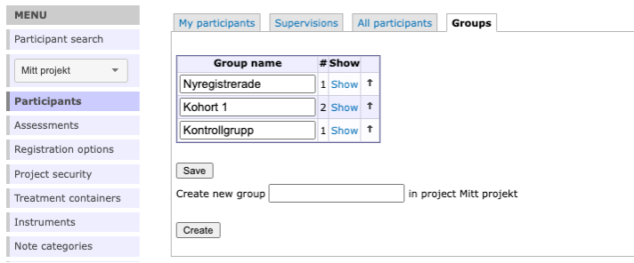

# Groups {#groups}

You can use groups in your project, for example to administer different cohorts. You access Groups from the “Participants” option in the main menu, and then you select the tab *Groups*.
 
To create a group, simply type the name into the text box and click *Create*. 

If you want to edit this name later on, you can easily do so by editing the name directly in its box and click *Save*.

 
In the groups overview one can see the number of participants in each group.

>*Hint:* You can rearrange the order of the groups by using the arrows in the right most column

To administer a group further click *Show* on the group you are interested in. This will take you to a view with two tabs

- Group participants
- Group Assessments

In *group participants* you can se a list of all the participants in the current group. From here you can administer the participants individually just like in the other participant list views. See more on this in **Chapter \@ref(participants)**

## Group Assessments {#groupassess}

TBD...

