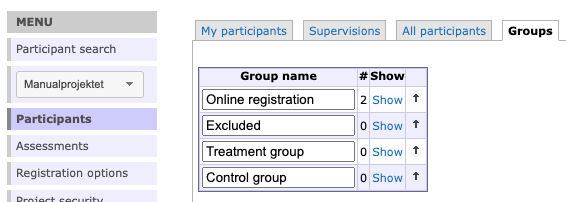
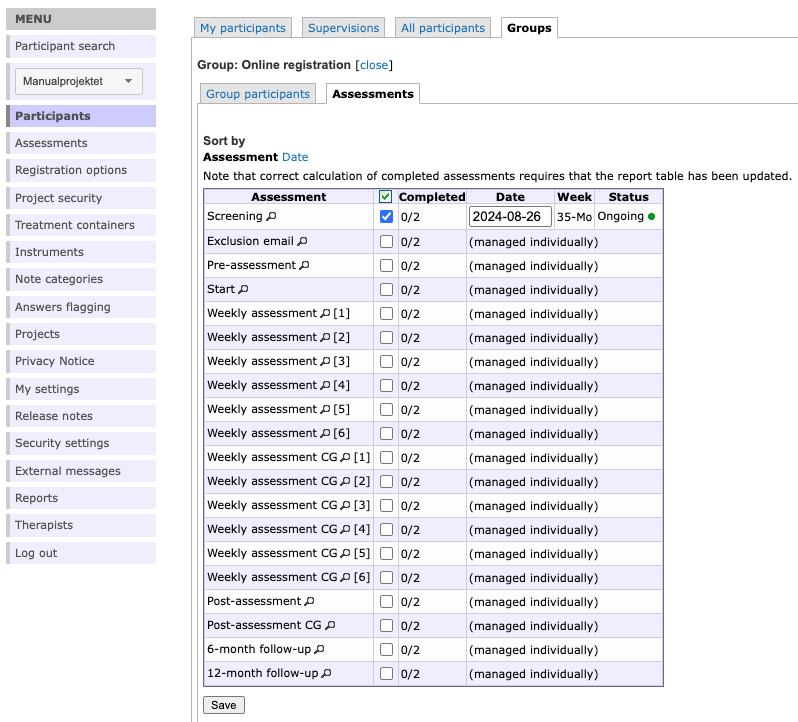
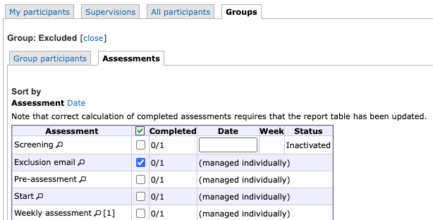
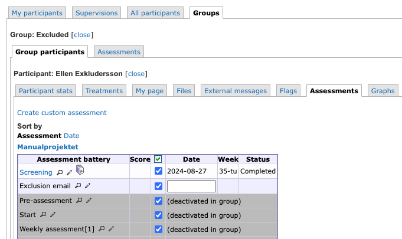
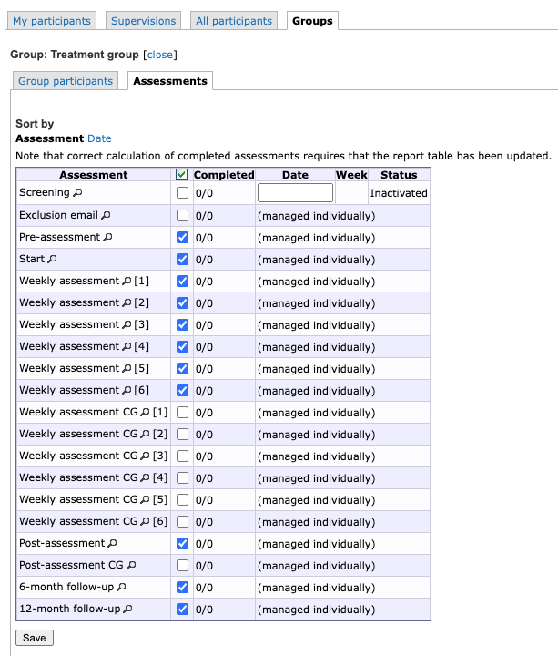
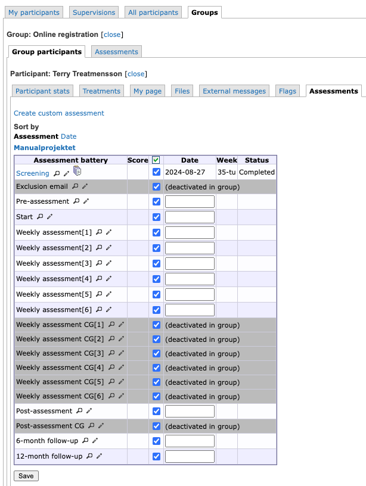

# Groups {#groups}

You can use groups in your project, for example to administer different cohorts. You access Groups from the “Participants” option in the main menu, and then you select the tab *Groups*.
 
To create a group, simply type the name into the text box and click *Create*. 

If you want to edit this name later on, you can easily do so by editing the name directly in its box and click *Save*.

 
In the groups overview one can see the number of participants in each group in the #-column.

>*Hint:* You can rearrange the order of the groups by using the arrows in the right most column

To administer a group further click *Show* on the group you are interested in. This will take you to a view with two tabs

- Group participants
- Group Assessments

In *group participants* you can se a list of all the participants in the current group. From here you can administer the participants individually just like in the other participant list views. See more on this in **Chapter \@ref(participants)**.

## Group Assessments {#groupassess}

Here you can aminister which assessments are available for the different groups in your project group.

>**Hint:** This kind of setup is not necessary but will be limiting the accidental assignment of irrelevant assessments to a participant. It is helpful if you have a complicated assessment schedule where different groups of participants should be assigned different assessments. 

We will show the possibilities with this functionality through a common assessment setup including screeening, pre- , weekly, post-, and follow-up assessments. Some of the assessments differ for the treatment group and the control group. There is also one assessment for excluded participants.

As seen in this example above, all assessments have been deselected for the *Online registration* group except for the screening assessment. This means that the other assessments are disabled for all participants in this group. 

Furthermore, the Screening assessment has been given a start date, meaning that it will be available right away for someone who registers for the study online. The possibility to set a date here is only available for group assessments. See ***Chapter \@ref(assessmentsmanaged)*** and ***Chapter \@ref(registration)*** for further details.

In order to assign the rest of the assessments to the participants in this setup, you need to move the participant to the next relevant group; Excluded, Treatment group, or Control group, depending on their answers in the screening assessment. This can be done in one of the Participant list views, or from the particiant's tab *Participant stats*.

For the *Excluded* group we only want to be able to send out a predefined email notification (an assessment without instruments, see ***Chapter \@ref(dummyassessments)***) informing the participant of the exclusion. No other assessments should be available, which can be achieved through the following setup:

Through this setup we will have this view for all excluded participant, ie. the possibility to send out the exclusion mail and nothing else:

For the *Treatment group* the relevant assessments are made available in a similar way:

Due to this setup the *Pre-assessment* can be sent out from the participant's assessment tab as soon as the participant has been moved to this group, by specifying an activation date. And when the answers have been submitted from the participant and the treatment is ready to start, the *Start* assessment can be activated, which in turn automatically activates all weekly, post, and follow-up assessment that are available for the *Treatment* group (but excludes the control group specific assessments). 

>**Hint:** For more information on how to set up a schedule of dependent assessments see ***Chapter \@ref(dependence)***.

