# Reports {#reports}

Reports lets you extract reports on data collected through instruments and assessments in BASS. You can create as many reports as you want by clicking *Create new report*. It is not possible to delete a report. So if you accidentally create one, just give it a name to indicate that it is not in use, and reuse it the next time you wan to create a report.

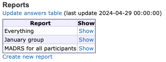

>**IMPORTANT NOTE:** To see the correct data in your report you need to make sure that you load the latest data to the report tool. You do this by clicking *Update answers table*. Make a habit out of always doing this before you create a new report or use a previously defined one.
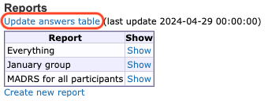

Click *Show* on one of the reports to view or edit the report. You will no be able to specify your data in two tabs; *Database selection* and *Viewing options*, and view the result in the third tab; *Show report*.

## Database selection

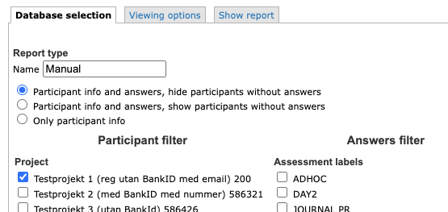

This tab lets you specify a name fot your report and filter your data. This is especially helpful if you have several projects in your database and only want to see data from a specific project. You can also filter your participant on groups. When it comes to the answers your participants have provided, you can filter on assessment labels and instruments. 

You can use filters in one or several categories. If you don't select any specific projects, groups, assessment labels or instruments all data in your database is included.

You can also select if you want to include participants that do not have any answered instruments or not. If you are interested in exporting participant data only, without any instrument answers, there is an option for that too.

Remember to save your filters at the bottom of the page.

## Viewing options
This tab lets you specify the details of how you want to see your data.

### Participant information

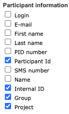

If you are generating a report with answers you might want to export only participant ID or internal id inorder to get pseudonymised data. If you have selected the option *Only participant info* on the previous tab you might however want to include more data on the participant.

>**Note:** Internal ID is the participant database record ID while the Participant Id can be manually defined in BASS

### Treatment information

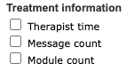

It is possible to include some information related to the participant's treatment. 

*Therapist time* refers to the time spent by therapists on interacting with the participant in a treatment, if this has been recorded. It is shown in the report in seconds, per therapist and in total. 

*Message count* refers to messages sent between the participant and the therapist. In the report it is shown from the participant's perspective, i.e. *Sent* represents number of messages sent by the participant, and *Received* the number of messages received from therapists.

*Message count* refers to the number of modules the participant has/had access to. It does not include informmation on whether the participant has finished or even opened the modules.

>**Note:** See ***Chapter \@ref(parttreat)*** for more information on tracking therapists' time spent on treatments.

### Sort priority

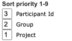
If you want you can define the sort order of your output data here. The picture above represents the output being sorted first on Project, then Group and lastly Participant Id.

### Answers hiding and date showing

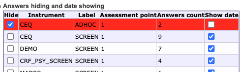

This table lets you select individual instruments that you want to exclude from the results by checking the *Hide* field. If the instrument is not excluded you can choose to check the *Show date* field instead to include information on the date when the participant answered the instrument. 

### Show sums/items per instrument

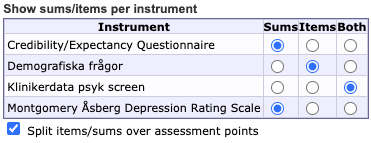

Select for each instruments whether you want to show only sums (the scoring that has been defined for the instrument) or answers to all the individual items in the instrument, or both sums and items.

### Generating options

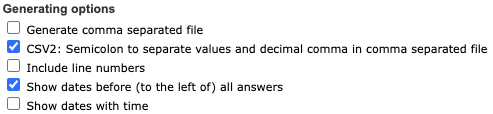

If you want to get an output file rather than seeing the results in the application, check the first option *Generate comma separated file*. If you have checked *Show date* for any of the instruments in the previous section, make sure to leave *Show dates before (to the left)* checked, and if you want even more details for the time stamps check *Show dates with time*

## Show report

When you have selected all your viewing options, go to the tab *Show report*. Your data will be displayed in a table or as a link to a downloadable file depending on you generating options.

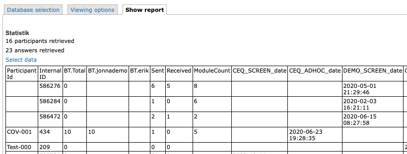

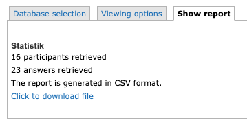

