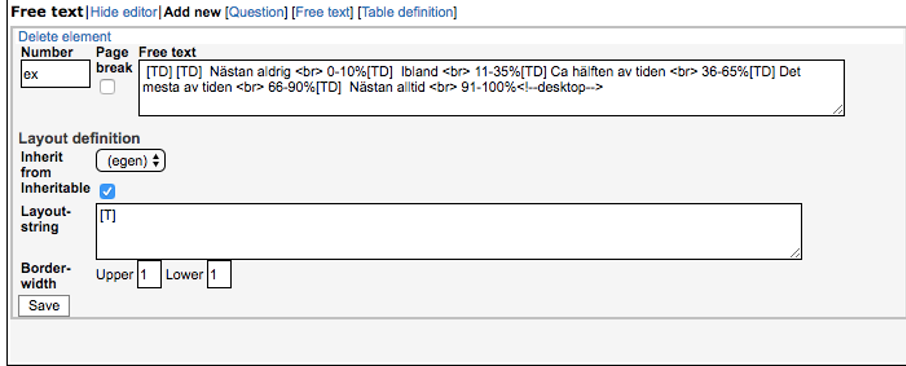

---
title: "BASS4 - ADMINISTRATOR’S MANUAL"
author: "Louise Serenhov, Erik Sjöstrand, Jonna Ekelin Thomas, Jenny-Li Örsell & Brjánn Ljótsson"
date: "Last updated `r Sys.Date()`, current BASS version: 4.11"
site: bookdown::bookdown_site
output: bookdown::gitbook
documentclass: book
bibliography: [bibliography.bib, packages.bib]
biblio-style: apalike
linkcitations: yes
github-repo: BASS-manual/manual
description: "Adminstrator`s manual for BASS4."
---

# Introduction

*Disclaimer: This manual is written primarily for full-access database administrators. While you will find instructions and useful tips even if you’re not an administrator, note that all options described may not be available to you if you have limited access.*
In this manual you will learn how to manage participants, combine self-help material into treatments, keep track on events during an ongoing study/program, manage security and privacy settings, collect and export data and communicate with participants through the administration interface of BASS.

Should you have questions not yet answered by this manual, you're very welcome to contact us at `bass-support[at]ki.se`.

BASS is comprised of two main parts, or user interfaces: the administrator’s view and the participant’s view. These are part of the same database, but accessed through slightly different web addresses, URL:s.

1. The administrator’s view is accessed through the URL https://webcbt.se/YourDataBase or its variant https://bassdb.se/YourDataBase. 
2. The participant’s view is accessed through a similar URL: https://YourDataBase.webcbt.se or its corresponding variant https://YourDataBase.bassdb.se.
3. These different URL domains are presented as options for you to choose which one suits your project the best. A research project might not have much in common with CBT treatments, and as such the domain ”webcbt.se” might seem a little odd to participants. In such cases, the domain ”bassdb.se” might be more suitable. On the flip side, ”webcbt.se” might be a perfect fit in the case where CBT treatments are in fact the main part of your project.
4. BASS is a powerful and flexible tool specifically designed for online psychological research projects or treatment programs. It supports online registration, assessment, treatment as well as being able to provide detailed data reports.
5. BASS is currently used by a multitude of different research projects and treatments.
6. We offer active remote support accessed by mail, telephone and/or digital meetings such as Zoom, Microsoft Teams or similar applications. For clients located in Stockholm, Sweden and the surrounding area, we also offer in-person meetings at the Karolinska Institutet campus in Solna.

<!--chapter:end:index.Rmd-->

# The Basics

Let’s begin with the basics, and start with a quick overview of the participant’s view. It is a good idea to familiarize yourself with this view, as most of what you do in the administrative view will have one or more effects in this view. As such, before we begin tweaking things we ought to know what we are tweaking.

1. The login screen for participants is accessed by either `https://YourDataBase.webcbt.se` or `https://YourDataBase.bassdb.se`, as noted earlier. This is where your participants will login to their personal account and access assessment and/or treatments. To create an account, a participant can either register one themselves through BASS’ built-in registration feature or have their account set up by you, the administrator. We will touch on both of these subjects later on in the manual as they both require detailed explanations.
2.	When your participants have logged in, there are three possible screens they may encounter depending on whether they have an active assessment and/or treatment or not.
    - If your participant has an active assessment, they will be presented with it as soon as they log in. This is true even if they also have an active treatment. When they’ve completed the assessment, they will be taken to the home page if they have an active treatment. If they do not have an active treatment, they will be automatically logged out since there is nothing else for them to do in BASS at that point.
    - If your participant does not have an active assessment, they will be presented with their home page.
    - If your participant has neither an active assessment nor an active treatment, they will be automatically logged out since there is nothing for them to do in BASS.
3.	When your participants have active treatments and no active/pending assessments, they will land at their treatment's home page. Here are the most common menu options in a treatment:
    - Start Page – their treatments' welcome page
    - Modules – Treatment modules. Clicking here shows treatment modules you’ve marked as ”accessible”.
    - Messages – BASS’ built in messaging feature which enables secure messaging between a participant and their assigned therapist.
    - Privacy notice – A legal document which is required by EU law (GDPR) and explains what personal data is collected by the project, who stores it and who has access to it.
    - Log out – Logs the participant out of BASS and ends their session.
4.	We will touch upon all these and other treatment menu options later on in the manual. For now, we’re just getting acquainted with the user interface. You may have noticed that there are no menu option for assessments. This is because they are handled differently than treatments. We will return to this topic later on.

<!--chapter:end:00-Basics.Rmd-->

# Dictionary
These are recurrent concepts in the manual:

**Instrument**  
An instrument is an electronic version of a paper form used during psychological assessment. Some examples of digitalized instruments are VAS (visual analogue scale), MADRS (Montgomery Åsberg Depression Rating Scale), SWLS (Satisfaction With Life Scale) and LSAS (Liebowitz Social Anxiety Scale).

**Assessment**  
An assessment is a set of instruments, given in a specific order and at a specific occasion or for a specific number of occasions. A pre- and post-treatment assessment often consist of the same instruments with the afterward addition of one instrument measuring treatment satisfaction.

**Project**  
A project is the administrative concept that connects a set of assessments to a set of participants.

**Participants**  
A participant need to be assigned to a project to be able to fill in instruments and follow an assessment.

**Group**  
A project can be divided into groups, and the assessments of participants of the same group in a project can be managed collectively.

**2FA**  
2FA stands from *two-factor authentication*, which is required by BASS by default. As of this writing, this could be set up to use SMS, e-mail och authenticator apps (TOTP).

<!--chapter:end:01-Dictionary.Rmd-->

# Login

As soon as your database setup is ready, you can login to the administrator’s interface. The interface is found at an URL of the format `https://webcbt.se/NameOfYourDatabase` or `https://bassdb.se/NameOfYourDatabase`. Enter your credentials in the login box and press the Login button.
 
 

<!--chapter:end:02-Login.Rmd-->

# Getting your bearings: Navigating the administrator's interface

Placeholder

## The intended structure of a BASS project
### Setting up your project
### Groups

<!--chapter:end:03-Navigating-in-BASS.Rmd-->

# Settings and security
The security settings are split up between two menu options: The **Project security** and **Security settings** options, respectively. **Project security** deals with two-factor authentication for your participants in a specific project. You are given the options to provide 2FA via SMS or e-mail, or both. You can also opt to use 2FA via one of two authenticator mobile apps: Microsoft Authenticator or Google Authenticator. This option is called TOTP.
**Security settings** handles global security settings for your database.

**Security settings (therapists)**
Here you can choose by which mean (SMS and/or e-mail) you want 2FA for therapists. Check the box or boxes for the options you want to use.
Below the 2FA options are *password requirements*. Here you can specify rules for the passwords of therapist logins. You can also specify if you want mandatory password changes by typing in a number in the box labeled *Monthly interval* for mandatory password change.

**Security settings (participants)**
In this table you can decide whether you want to use the quick login feature or not, as well as specify the settings for it. To allow the use of it, simply check the box labeled *Allow quick login*.
In the box below, you can specify what number of days the quick login codes are valid after they’ve been generated (default 14 days). Be wary of allowing too long periods of time, since quick login codes does not require user names, passwords or 2FA. Before you consider using quick login codes, make sure your participants does not share e-mail accounts for cell phones with anyone else. ***If another person gets hold of an active quick login code link, they will have access to that participant login as long as that code stays active.*** Note however that the quick login only gives access to assessments, access to treatment always require a password.

Below the duration setting, an example URL for quick login codes is shown.

>***Wait! What are quick login codes?***
>Quick login codes are sequences of numbers and letters that are assigned to >participants. Each participant is assigned their own unique code. BASS can >use these unique codes to identify the participant and log them in to their >account automatically, without requiring user name, password or 2FA. This >is useful if you wish to streamline the login process and lower the >barriers for your participants. As mentioned above, it does pose some vital >security questions however and should not be used unless you feel >comfortable in that the security of your participants isn’t jeopardized.

**Lost password method**
The options here allow you to specify how participants who report lost passwords are handled. You can choose whether to require participants to confirm their e-mail or not before they’re flagged as having reported a lost password.

**Participant files**
This option governs whether the uploading of participant specific files is allowed. This options is provided to allow different therapists to upload for example offline paperwork as a scanned file, or a complex figure drawing. This is a solely administrative side feature, and does not allow uploading and sharing of files with the participant in question.

**OAuth TOTP app links (participants)**
The OAuth feature allows you to use authenticator apps (for example, Google Authenticator or Microsoft Authenticator) for two-factor authentication. This is a more secure way to use 2FA than SMS or e-mail, but requires a few more steps for the participant to activate. For participants who are less accustomed to modern technology, 2FA via SMS or e-mail may be preferrable.

The selection here determines what apps are suggested when participants install TOTP on their smartphone. We can add links to other apps on your request.

<!--chapter:end:04-Settings-and-security.Rmd-->

# External messages
Under this menu option, you can adjust the settings for external messages sent from BASS (SMS and e-mail), as well as type standard messages to be used for assessments and treatments.

**SMS settings**
The first box is labeled *SMS sender name*, and is the name shown as the sender when a participant or therapist receives an SMS from your database.
The box below, labeled *Standard SMS with quick login code*, is only relevant if you’ve elected to use quick login codes (see the previous chapter: Settings and Security). The message you type here will be the standard message that participants receive when their quick login codes are updated.

Below that is the dropdown menu *Delivery method for new message notifications to therapists*. Currently, this setting has no effect and BASS does not give immediate information about new messages.Therapists are instead informed about new messages through the nightly "Unhandled participant tasks" email.

**New treatment message notification settings**
Here you specify how notifications about new messages will be delivered to participants, and what the notification message is. You can have them delivered by SMS or e-mail, by checking the relevant radio button.
Below that, there is a box for *New message email subject*. This is only relevant if you’ve selected the e-mail radio button above. This is the subject header for the e-mail that is sent to the participant as a notification of new treatment content.
The box labeled *New message notification* is where you type the message that will be sent as an SMS or e-mail according to the settings you’ve specified above.

**SMS count per month**
This table shows you how many SMS messages have been sent from your database on a monthly basis, with a total summary at the bottom.

**Email settings**
Under this headline are the settings for e-mail addresses connected to your database. The first one, *Sender automatic messages*, is the e-mail address that is shown when automatic e-mails are sent to participants or therapists. These are by far and large notification messages. It is set to webcbt-noreply[at]ki.se by default.
Below that is the *General mailbox for database*. This e-mail address is shown to participant as the contact e-mail in case they’re experiencing issues. It is also used as a fallback address in case a participant does not have a therapist assigned to them, so that they won’t go unnoticed if they report a lost password or score an instrument in a manner that requires immediate attention.

**Assessment reminder settings**
Here you specify the settings for automatic reminders connected to assessments. You can specify at what hour you want reminders to be sent (default is 12, at noon). This works on a 24-hour basis, so you can set any whole number between 0-24.
You can also specify a time after which no reminders will be sent. This is useful if you want to spare your participant the annoyance of being reminded to complete their assessments at 23:00/11 pm.
Below these settings are two textboxes, *Standard SMS assessments reminder* and *Standard email assessment reminder*. In these boxes you can type standard messages for reminder notifications. If you want custom reminder messages for assessments, you can type them in the corresponding text box in the assessment editor.

<!--chapter:end:05-External-messages.Rmd-->

# Registration options

Placeholder

<!--chapter:end:06-Registration-options.Rmd-->

# Search participants: Finding what you need

Placeholder

## Selection/filter
## Search
## Hide, show and sort columns
## Column explanations
## Save/load search settings

<!--chapter:end:07-Search-participants.Rmd-->

# Participants

Placeholder

## Creating, deleting and editing participants
## The participant view
### Participant stats
### Participant treatments

<!--chapter:end:08-Participants.Rmd-->

# Instruments

Placeholder

## Copy an instrument
## Creating a new instrument
### The General Tab
#### The BASS4 Table
### The Preview Tab
### The Edit Tab
### Extra information
## Scoring formula
## Export

<!--chapter:end:09-Instrument.Rmd-->

# Assessments

Placeholder

## Create or edit assessments
### Name 
### Label/Custom label 
### Managed 
### Repitition 
### Time limit 
### Clinician rated
### Randomize instrument order
### Welcome/Thank you text 
### Concurrent and merged assessments 
### Automatic reminders 
### Participant flagging 
## Copy assessment 
## Dummy assessments - some scheduling tricks 
## Assessment instruments 

<!--chapter:end:10-Assessments.Rmd-->

# Create new treatment 

Placeholder

## A typical treatment structure
## Creating a treatment container
## Creating a treatment
## Treatment Modules
## Treatment Content
### Content text

<!--chapter:end:11-Treatment-containers.Rmd-->

# References

In this chapter we list some helpful references and tools that might aid you when working with BASS.

## Tools and resources for working with treatments
Treatments are the most complex and knowledge-intensive thing to build and maintain within BASS, as they require some know-how when it comes to **Markdown** and **HTML**. If you want to add some stylish flair to your treatment, you'll need to dive into a bit of **CSS**. 
More advanced and more interactive treatments might require knowledge of **JavaScript** as well. Here below are some online resources and tools which you may find helpful:

**Coding software (IDE:s)**

- https://atom.io (an open-source IDE with good enthusiast support)
- https://code.visualstudio.com (a full-featured IDE from Microsoft)

**Online resources on Markdown, HTML, and JavaScript**

- https://www.markdownguide.org (a well presented and comprehensive guide on using Markdown)
- https://www.w3schools.com (a good resource for referencing HTML, CSS and JavaScript)
- https://javascript.info (an in-depth and comprehensive guide and tutorial on JavaScript)

<!--chapter:end:12-References.Rmd-->

---
title: "12-Therapists"
author: "BASS-support"
date: '2020-07-07'
output:
  pdf_document: default
  html_document: default
---

# Therapists

The term "therapist" is the term used within BASS to designate anyone who administrates part of or the entirety of a database and its participants. This could be an administrator, whose job it is to build treatment content, instruments and assessments. It could also be a licensed therapist who administers treatments to select participants. It could yet again be students who use BASS as part of a university course in web-based CBT, as well as their supervising teacher or professor.
The common denominator for all these examples is that they all use a therapist account. What separates them are the differing levels of access (**privileges**) given to them. In this chapter, we will take a look at the therapist accounts, how to set them up and what levels of **privileges** can be given to them.

## Creating a therapist account
To create a therapist account, you need three things:

- The name of the person who will use the account
- A working e-mail address for that person, i.e a work e-mail/faculty e-mail
- A working cell phone number for that person

**A few notes**: The name is not strictly required to be the actual name of the person, but we strongly recommend to use the person's proper name for ease of supervision/activity tracking should it be necessary.
We furthermore *strongly* recommend the use of work/faculty e-mail or other similarly secure e-mail service backed by your IT department. We generally do not recommend you use publicly available e-mail services such as Gmail, Hotmail, Yahoo and the like.
Lastly, the cell phone number is required for two-factor authentication. Without it, you will not be able to log in to BASS as a therapist. There is no option to disable two-factor authentication for therapists, but you can choose to send the authentication message via e-mail rather than via SMS.

## The "Manage Therapists" view
This is the landing page when clicking the **Therapists** menu option in the main menu. Normally, the first accounts created are ***admin*** and any accounts used by the BASS support staff. There's no tag or icon designating BASS support staff as such, other than the fact that they will always carry the star moniker which indicates that they are *database administrators*.
You therapist account has most likely been set up by the BASS support staff, and as such your account is also shown in the list. But what about creating new accounts? Let's have a look!

### Creating a new therapist account
To create a new therapist account, click the *Create new therapist* link below the list of existing accounts. This will present you with the information view. Here, in the first small table, you can see *last login*, *login count*, *total time*, and *internal id*. All of these are superfluous for now, but are self-explanatory in their function (the *internal id* is used by BASS to identify individual therapists, and may be used to communicate outside of BASS in potentially delicate matters pertaining to specific therapists).
Below the first little table is a bigger table, with which we will concern ourselves now.

- Login: in this field, you type the username of the therapist account. We recommend keeping a simple format, such as *firstname*, *firstnamesurname* or *firstname-surname*.
- Full name: in this field, you type the full name of the person who will use the therapist account (i.e Firstname Surname)
- Email: here, you type the e-mail address which you wish to associate with the therapist account. This e-mail will be used by BASS to send daily updates on participant activities that necessitates inspection or taking action. Only the activities of participants for which the therapist is designated as "therapist" will prompt such updates to the therapist.
- SMS number: here, you type the cell phone number you wish to associate with the therapist account. As noted above, unless you've changed the delivery method for two-factor authentication messages, this is mandatory.
- Send SMS/email when supervisor send messages: by checking this box, the therapist will be notified by SMS and/or e-mail when their supervisor (if any) sends them a messages within BASS. This is mainly used in educational settings, where students are assigned a supervisor.
- Login allowed: checking/un-checking this box enables/disables logging in for the therapist account.
- Login expiration date: by clicking the empty text box, you will be shown a calender. From this calender you can pick a date up to 182 days in the future to set it as the expiration date for the therapist account allowed login. It is mandatory to set an expiration date, otherwise the therapist will be unable to log in. This date can be extended later on, but no more than 182 days from the current date. This feature is a safeguard to prevent old therapist accounts from being active beyond their intended use.
- Must change password: by checking this box, the therapist will be required to submit their own personal password upon their first time logging in. I.e the password you set when creating the therapist account will be a temporary, one-time use password if you check this box.
- New password: here, you type the password for the therapist account
- Confirm password: here, you confirm the password you've typed above.

When you've entered the information into the fields listed above, click *Save*.

### The Information Tab
Now that you've saved the therapist account you just created, you should be presented with the **Information** tab for that therapist account. For all intents and purposes, it contains the information you just submitted. From this tab, you can edit the information as well as enable/disable login, extend the expiration date and provide the therapist with a new password if needed.

### The Privileges Tab
In this tab, you set the privileges given to the therapist account. At the top of the page, you will see the dropdown menu named **Senior therapist**. By defauly, *admin* will be selected. You can leave this as-is.

Beneath the dropdown menu, there is a table named **Global privileges**. These are privileges pertaining to the entire database. If you want to give the therapist account full access to the databse, chech the box named *Administrative privileges*.

A more in-depth look at the different privileges follows below:

- Edit answer flag settings: by checking this box, you give the therapist account access to view and edit answer flag settings under **Answers flagging** in the main menu.
- Administrative privileges: as noted above, checking this box grants the therapist account full access to the database.
- Edit other therapists: by checking this box, you give the therapist account access to view and edit other therapist accounts.
- Groups view: checking this box lets the therapist accounts view the **Groups** tab under **Participants** in the main menu.
- Edit note categories: As with "Edit answer flag settings", checking this box grants access to view and edit note categories under **Note categories** in the main menu.

### The Preview Tab
In this tab, you can view the instrument with it's final visual design applied (the final visual design is applied automatically by BASS) by clicking the hyperlink named "Open preview in Clojure app". 
By default, a new tab will open, in which the instrument will be displayed with its final visual design applied. It's a good idea to have this tab opened while editing the instrument in the instrument editor, and switching back and forth between the browser tabs to see your updates displayed in the Preview.

### The Edit Tab
This tab is where you create, or build, your new instrument. This is also where you adjust any instrument you've copied or want to edit. This is mainly done through adding, editing or deleting content in the form.
To begin, start by creating and defining a **table definition**

**Add table definition** 
By default, the first table definition is already created. However, it has not been defined, and thus you need to define it before proceeding to adding additional items and elements to your instrument. To do this, click the "Edit" text in the **Table definition** box. This opens up the editor for this specific item (in this case a table definition).
One thing to note before starting to assign **Cell width** is that the total width of your instrument is fixed to 700 pixels on PC/Mac. As such, you will have to stay within those confines when defining your table definition. 
If responsive presentation is used, the instrument width will adapt to a mobile screen size where applicable.

A table definition provides a layout framework for every item below it, up until the next table definition (if there is one).

A good practice is to allow the first column to take up 30 pixels of screen space. This is done by typing 30 into the first box of the **Cell width** column. If you so wish, you can justify the text of a box to be either left aligned, centered, or right aligned by choosing the corresponding option in the box's dropdown menu in the **Justify** column.
The second cell is most often reserved to the text of a question, and can be set to the desired width by typing it into the box.
Typing a * into the box makes its cell flexible, causing it to fill any left over width not claimed by the other cells in the table definition. If multiple cells are given a flexible width by typing * in their cell width boxes, they will share the left over width evenly.
The third through 16th cell is usually utlized for answers to a question item, when ordered by **Cell** (horizontally) and can be given any desired width. However, remember that width is limited if you are ordering answers by **cell**, and that long words in an answer may clip into eachother if the allocated space is too small.
Ordering answers by **line break** organizes them in a vertical structure, and as such they do not suffer this limitation. If you plan to order your answers by **line break** you only need to fill in the boxes for cell 1 and 2 in your table definition that governs the layout for the question items that utilizes **line break**

**Add information** 
Usually a form starts with information on how to fill it out, and as such you want to add that information before you add your questions. To do this, click "Add new [Free text]" and type the information ionto the "Free text" box.

In "Free text" you type regular HTML or regular text input. You can find some basic HTML tags in the appendix of this manual, with links to more thorough resources listed as well.
In "Layout-string", you type [T], which instructs BASS to render the text in the "Free text" box. Then press save.

>**Hint:** If you want to have a line above or below your text, to act as a separator, you can type in 1 in the "Border-width upper" or "Border-width lower", respectively.

**Adding questions** 
Depending on what questions you would like to add, you go about adding them in different ways. We will adress the most common type of question below.

**Adding multiple-choice questions** 
By follow the instructions below, your end result will look similar to this:

First, you will need to add a new "free text". To do this, click "**Add new [Free text]**". Then type in the options that are needed for the questions you want to add. For example, if you have five options to your question, you type it in like in picture 4 picture below.

**Picture 4**

If you have more options, you add them by typing "[TD] option 6", before the HTML tag `<!--desktop-->`. If you have less options, you delete the superfluous [TD] with accompanying text. The reason for the twin [TD][TD] in the beginning is to make empty space for the question you're adding later. The reason for the single [TD] between the options is to separate the options.

>**Hint:** ` ` is HTML and means that the rest of the text starts on a new row, i.e it implements a line break. If you want to have numbers on one row and the text under, you can add two   tags in between. If it's all supposed to be on the same row, you can omit including any ` ` tags.

Like in the "Free text" example, you type [T] in "Layout-string" to instruct BASS to render the text. Then decide whether or not you want borders above or below the text by typing in a numerical value in "Border-width upper" or "Border-width lower", respectively. Then click "Save".

Below the created "free text", you now click "**Add new [question]**". In the number box, you type in the number you want to assign to the question. In the "Question"-box you type in the question or statement.

By using the tools in the "Answer definition" section, you can define what type of answer you want. By default, "**Radio buttons**" is selected as the "Answer type". If you want multiple choice, you change the "Answer type" to "**Checkboxes**".
You can then fill out the different options under "label" (in this example you would use the same options you typed in "free text") and give them unique values under "value", see picture 5 below. The values are used to calculate the result with a scoring formula later on.

>**Important note:** The values for each answer option in a question *have* to be unique. If to answer options are supposed to have the same value, this is corrected for later on in the scoring formula.

When you've filled in your answer options and their unique values, you can choose "Cell" under the "Separator"-dropdown. In "Layout definition" you type in the following: **[N].[TD][Q][TD][X]**. This defines the layout for the question within the framework provided by your table definition. When this is done, click "Save".

>**HELP! What does [N].[TD][Q][TD][X] mean?** 

>- [N] Renders the number of the question in a cell. The period simply puts a period after the rendered number. 
>- [TD] Creates an empty cell 
>- [Q] Renders the text of the "Question" box in a cell 
>- [X] Renders the answer options in a cell 

The input in the "layout definition" box is read from left to right, and is applied in the same order. In the layout above [N] is rendered in the first cell, [TD] creates a space, [Q] is rendered in the second cell and [X] is rendered in the third through seventh cell.

>**Hint:** Make a habit of going back to your Preview page to see what your form looks like. This lets you correct mistakes and make adjustments as you go along.

>**Hint:** You can read about "optional", "inheritable", "jump", and "specification text" under "Extra information".

**Picture 5**

**Adding a text-answer question** 
To add a question with a text answer, click "**Add new [question]**". Follow the same procedure as detailed above, by typing the number you want to assign to the question in the number box, and typing your question or statement into the question-box. Under "Answer definition", choose what type of answer you want, either "short free text" or "long free text". In "Layour-string", type in **[N].[TD][Q][X]**.

**Having the multiple-choice answer options listed vertically instead of horizontally** 
If you would rather have your answer options listed vertically below your question, you type the question in a Free text. To do this, click "**Add new [Free text]**". Then type the question into the free text box, and type **[T]** into the layout-string box.
Below the "free text" you just created, click "**Add new [question]**". In the number box, assign the number you wish your question to have. Leave the "question"-box empty.
Proceed to fill out the "Answer definition", and type in your answer options and their unique values. Then, choose "Line break" in the Separator-dropdown.

### Extra information

**Optional questions** 
If the question is not mandatory, you can tell BASS to treat it as such by checking the "optional"-box, in the upper right corner of the question-editor window. This enables a participant to complete the form without submitting an answer to that specific question.

**Page break** 
If you want a question to appear on a new page, you can tell BASS to divide your form into pages by checking the "page break"-box in the upper left corner of an editing window. By checking this box, the item for which you check it will be the first item to display on the new page. The following items will show on the new page.

**Using the jump function** 
If you want an answer option to skip a participant ahead in your form, for example if a subset of questions isn't relevant if a particular answer option is selected, you can do so by using the "jump"-function. You find this function to the right of each answer option. Open the dropdown, and select the item you wish that answer option to skip ahead to.

**Re-use layout and options** 
If you have multiple questions that use the same layout and/or the same options, you can check the "inheritable"-boxes for "layout-string" and/or "answer options". This enables the settings of one question to be inherited by another. In the editing window of the questions you wish to be inheriting settings, use the "Inherit from"-dropdown and choose the question you want them to inherit from.

**Adding more questions** 
*Adding a multiple-choice question that have the same options as the previous question*. 
If you want to add more questions with the same options as the previous question you just created, click "**Add new [question]**" and fill out the new question like you did the previous one.

>**Hint:** Don't forget that you can use the "inherit"-function. Read more about this function in the "Extra information"-section, "Re-use layout and options".

*Adding a multiple-choice question that do not have the same options as the previous question*. 
If your next question has a different set of answer options than the previous one, but the same number of answer options, you add a new free text and write the options like previously instructed, and then add the new question.

If your next question has a different **number** of options as the previous question, you need to add a new "table definition" that provides a new layout framework that fits the structure of the new question. Then proceed to add the new free text and question as previously instructed.

*Adding a text-answer question*. 
Create a new question by clicking "**Add new [question]**" and fill it out like previously instructed.

## Scoring formula
In the **Scoring formula** tab, you can define formulas that calculate the scores from the different items in your instrument. You refer to specific items in your instrument by using the `@#` identifier, i.e `@1` refers to question 1, `@2` refers to question 2, and so on.
Should you leave the scoring formula blank, you will still get all value readouts from your instrument. The scoring formula is meant to help with calculating different scores that are relevant to your instrument.

>**Defining a calculation:**  `sum = @1 + @2 + @3 + @4 + @5`  
`#sums sum`

If you want to calculate several sums or products, you define each score (`sum`) by giving it a number.

>**Adding several scores:**  `sum1 = @1 + @2 + @3` `sum2 = @4 + @5 + @6` `sum3 = @7 + @8 + @9` `#sums sum1, sum2, sum3`

>**Multiplying several scores:**  `sum1 = (@1 * @2) + (@3 * @4)`  `sum2 = (@5 * @6) + (@7 * @8)`  `#sums sum1, sum2`

You can also calculate the mean of a score, by dividing the number of questions included.

>**Calculating the mean of a score:**  `sum1 = @1 + @2 + @3 + @4 + @5`  `mean1 = @1 + @2 + @3 + @4 + @5 / 5` `#sums sum1, mean1`

Just as you can calculate several sums and products, you can also calculate several means.

>**Calculating several means:**  `mean1 = (@1 + @2 + @3) / 3`  `mean2 = (@4 + @5) / 2`  `mean3 = (@6 + @7 + @8 + @9) / 4`  `#sums mean1, mean2, mean3`

## Export
The export tab lets you copy the XML code of an instrument, to enable exporting to another database or another program that can accept instruments/forms in XML format.

<!--chapter:end:12-Therapists.Rmd-->

